# urpssim — Urogynecology Workforce Supply and Demand Microsimulation

A stochastic, individual-level microsimulation of the supply of and demand for
urogynecology and reconstructive pelvic surgery (URPS) services in the United
States, built to the methodology documented in the IHS Markit / Dall **Health
Workforce Microsimulation Model** (HWMM v5.19.20) and its published applications
in physiatry, neurology and physical therapy.

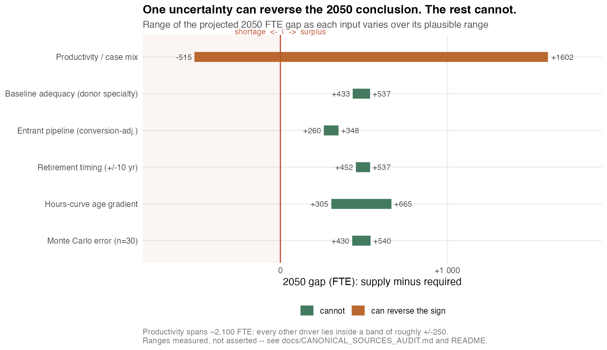

**The one-sentence version.** Under status-quo assumptions this model projects a
2050 *surplus* of urogynecologists — but among the empirical uncertainties
evaluated to date, productivity and case mix are the only ones spanning a range
wide enough to reverse that. Everything else, including the much-discussed
base-year adequacy anchor, moves the number without moving the sign.

That is the finding the rest of this README exists to justify, qualify, and let
you reproduce.

---

## How the model works

### The idea, before the machinery

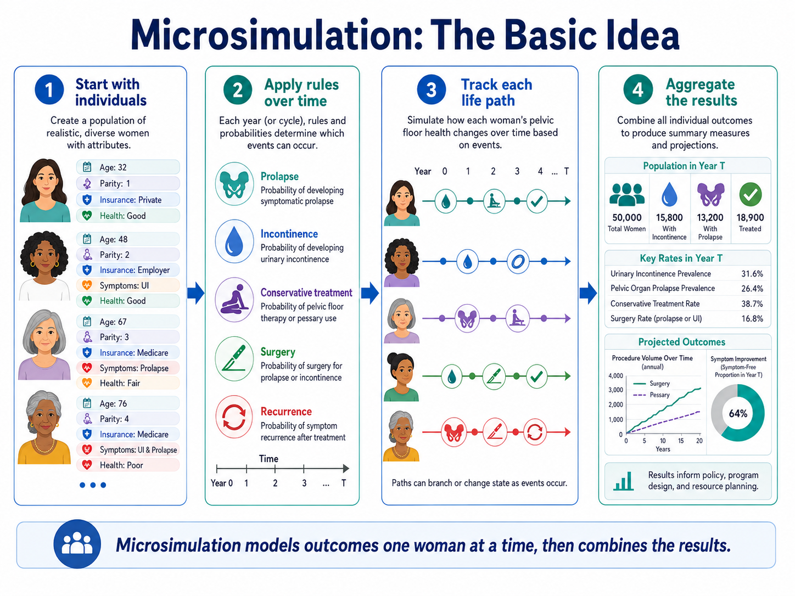

**The numbers on this panel are illustrative, not results.** 50,000 women, 31.6%
incontinence prevalence, 64% symptom-free — none of those are outputs of this
model. They are placeholders that make the *shape* of the method legible. The
model's own numbers live in the figures above and below.

What the panel does describe accurately is how this repository works on **both**
sides of the ledger, because both are individual-level:

- **Demand** — `R/demand-dynamic_multistate.R` follows each woman year by year
  through onset, remission and death across UI, POP and AI, so prevalence
  *emerges* from within-person dynamics rather than being read off a static risk
  equation.
- **Supply** — `R/supply-provider_microsimulation.R` does the same for provider
  careers: each physician ages, works a stochastic number of clinical hours, and
  retires or leaves on a hazard.

That is the whole reason a microsimulation is worth the cost here. A
compartmental model can tell you how many women have prolapse; it cannot tell you
what happens to a 67-year-old with a prior repair, and it cannot let a provider's
retirement depend on the age she happened to certify at.

### The demand side in detail

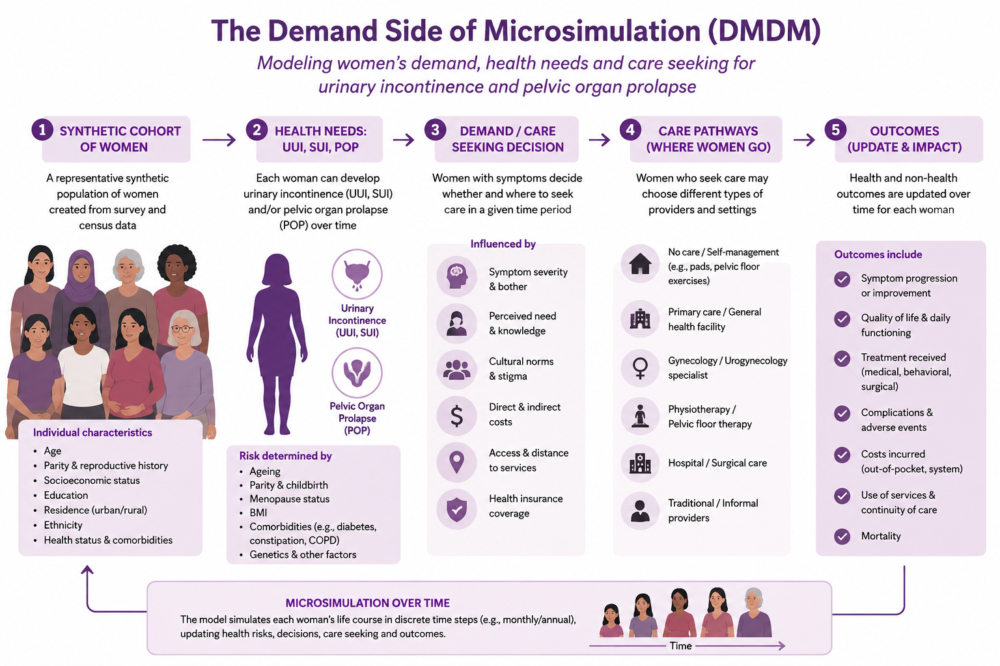

Five stages, from a synthetic cohort of women to outcomes that feed back into
the next year. **Not all five are built.** The panel is a design, and the
honest reading is a roadmap with status:

| stage | in this repository | where |
|---|---|---|
| 1. Synthetic cohort of women | **built** | `demand-lifecourse.R`, BRFSS population cells |
| 2. Health needs over time | **built, different states** | `demand-dynamic_multistate.R` |
| 3. Demand / care-seeking decision | **built, partially** | `data-meps_care_seeking.R` |
| 4. Care pathways | **partial** | `demand-condition_service_pathway.R`, `urps_prevention.R` |
| 5. Outcomes | **partial** | mortality and severity yes; quality of life no |

Three specific divergences worth knowing before quoting this panel:

- **The states differ.** The panel shows UUI, SUI and POP. This model carries
  **UI, POP and AI** — it does not split urinary incontinence into urge and
  stress, and it *does* carry anal incontinence, which the panel omits.
- **Care-seeking is narrower than drawn.** `fit_care_seeking_model()` estimates
  from MEPS on insurance, income and comorbidity. Symptom bother, perceived
  need, cultural norms and stigma are on the panel and are **not** in the model.
- **Quality of life is not modelled at all.** Mortality is, severity is
  (Sandvik), costs partly. There are no QALYs, utilities or functioning
  outcomes anywhere in the package.

### The three flowcharts

Three, because three different things can go wrong.

### 1. The estimation pipeline

Population and epidemiology set demand; a provider cohort sets supply; both are
expressed in clinical FTE so the comparison is dimensionally meaningful.

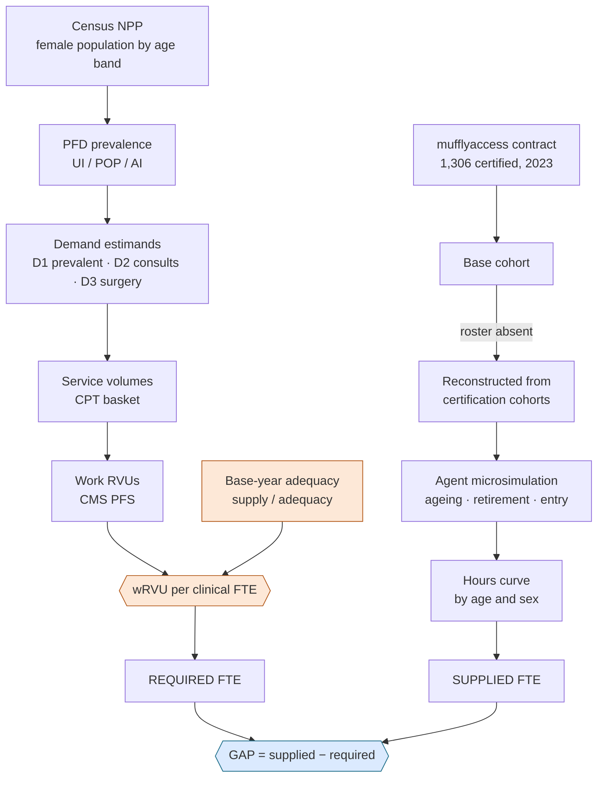
```mermaid
flowchart TD
  A["Census NPP<br/>female population by age band"] --> B["PFD prevalence<br/>UI / POP / AI"]
  B --> C["Demand estimands<br/>D1 prevalent · D2 consults · D3 surgery"]
  C --> D["Service volumes<br/>CPT basket"]
  D --> E["Work RVUs<br/>CMS PFS"]
  E --> F{{"wRVU per clinical FTE"}}
  F --> G["REQUIRED FTE"]

  H["mufflyaccess contract<br/>1,306 certified, 2023"] --> I["Base cohort"]
  I -->|"roster absent"| I2["Reconstructed from<br/>certification cohorts"]
  I2 --> J["Agent microsimulation<br/>ageing · retirement · entry"]
  J --> K["Hours curve<br/>by age and sex"]
  K --> L["SUPPLIED FTE"]

  M["Base-year adequacy<br/>supply / adequacy"] --> F
  G --> N{{"GAP = supplied − required"}}
  L --> N

  style F fill:#fde8d7,stroke:#b3591a
  style M fill:#fde8d7,stroke:#b3591a
  style N fill:#dbeafe,stroke:#1f6f8b
```

The orange nodes are the ones to watch. `wRVU per clinical FTE` is **solved**
against the base-year anchor rather than measured, which is why productivity
uncertainty is invisible in the anchored configuration and dominant the moment
you ask for an unanchored demand level.

### 2. The evidence gate

A number is not reportable because it exists. Each demand estimand rests on
several evidence dimensions, and the *weakest* one governs.

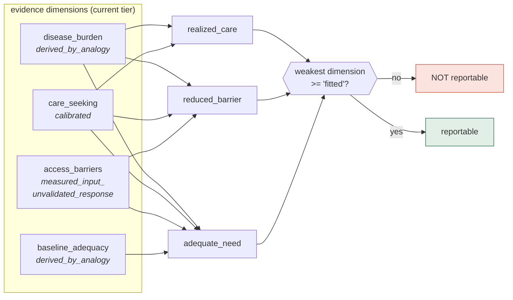
```mermaid
flowchart LR
  subgraph DIM["evidence dimensions (current tier)"]
    D1["disease_burden<br/><i>derived_by_analogy</i>"]
    D2["care_seeking<br/><i>calibrated</i>"]
    D3["access_barriers<br/><i>measured_input_<br/>unvalidated_response</i>"]
    D4["baseline_adequacy<br/><i>derived_by_analogy</i>"]
  end

  D1 --> E1["realized_care"]
  D2 --> E1
  D1 --> E2["reduced_barrier"]
  D2 --> E2
  D3 --> E2
  D1 --> E3["adequate_need"]
  D2 --> E3
  D3 --> E3
  D4 --> E3

  E1 --> G{{"weakest dimension<br/>>= 'fitted'?"}}
  E2 --> G
  E3 --> G
  G -->|no| X["NOT reportable"]
  G -->|yes| Y["reportable"]

  style X fill:#fbe4e0,stroke:#c1543a
  style Y fill:#e2efe7,stroke:#2f6b4f
```

All three are currently **not reportable**. `realized_care` is one onset fit
short; the two counterfactuals additionally require validating the decay
function that turns travel time into a barrier — which a verified isochrone
surface does *not* supply. Run `demand_estimand_table(demand_dimension_status())`
to see the live answer rather than this snapshot.

### 3. The provenance gate

The isochrone import is the worked example of how an artifact earns its way in.
The source tree contained a quarantined "contaminated" cache, an
`archived_unusable/` directory, a file named `..._backup_may8_broken.rds`, and a
newer run whose `PIPELINE_SUCCESS.json` contradicted its own manifest.

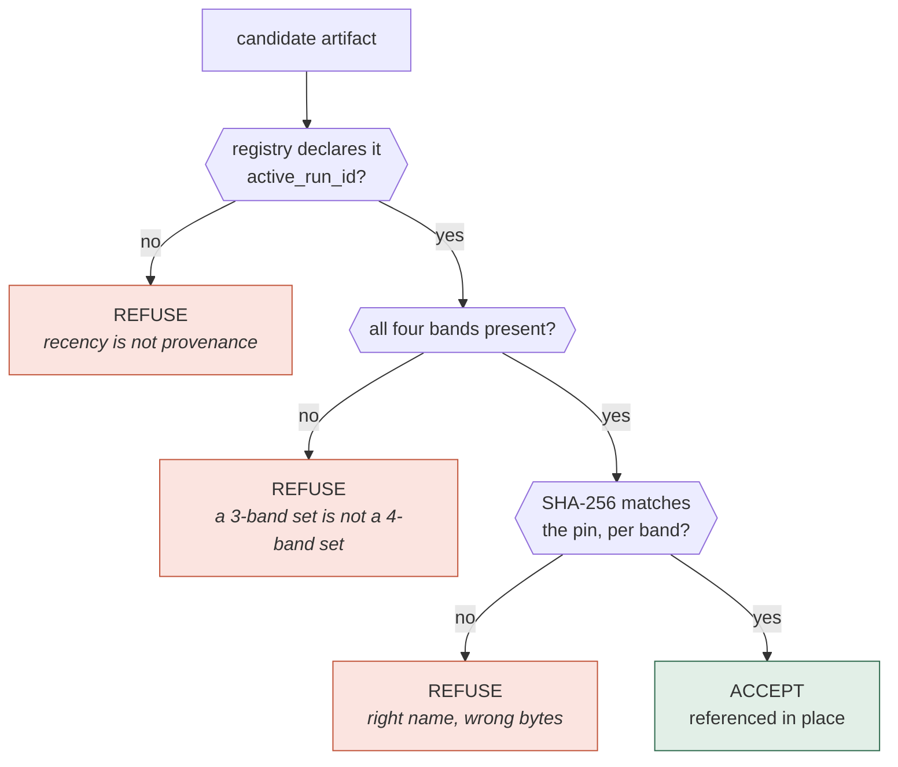
```mermaid
flowchart TD
  A["candidate artifact"] --> B{{"registry declares it<br/>active_run_id?"}}
  B -->|no| R1["REFUSE<br/><i>recency is not provenance</i>"]
  B -->|yes| C{{"all four bands present?"}}
  C -->|no| R2["REFUSE<br/><i>a 3-band set is not a 4-band set</i>"]
  C -->|yes| D{{"SHA-256 matches<br/>the pin, per band?"}}
  D -->|no| R3["REFUSE<br/><i>right name, wrong bytes</i>"]
  D -->|yes| E["ACCEPT<br/>referenced in place"]

  style R1 fill:#fbe4e0,stroke:#c1543a
  style R2 fill:#fbe4e0,stroke:#c1543a
  style R3 fill:#fbe4e0,stroke:#c1543a
  style E fill:#e2efe7,stroke:#2f6b4f
```

Sorted by filename or by date, the wrong artifact wins. Sorted by recorded
provenance, the right one does. `ISOCHRONE_REFUSED_ARTIFACTS` records every
rejected candidate *with its reason*, so a refusal is a decision on the record
rather than an omission someone later "fixes".

### 4. Comprehensive Supply & Demand Module Flowcharts

#### Demand Pipeline Flowchart

```mermaid
graph TD
    classDef dem fill:#e1f5fe,stroke:#0288d1,stroke-width:2px,color:#01579b;
    classDef proc fill:#e8f5e9,stroke:#388e3c,stroke-width:2px,color:#1b5e20;
    classDef outp fill:#fff3e0,stroke:#f57c00,stroke-width:2px,color:#e65100;

    POP["Step 1: Census and ACS Female Microdata<br/>demand-synthetic_county_population.R"] :::dem --> EPID["Step 2: Epidemiological Baseline Anchors<br/>NHANES and JAMA/AOG Prevalence<br/>demand-nhanes_pfd_prevalence.R"] :::dem

    EPID --> TRAJ["Step 3: Dynamic Multistate Trajectories<br/>SWAN Longitudinal Markov Chain<br/>demand-swan_incontinence_markov.R"] :::proc

    TRAJ --> RECUR["Step 4: Incidence and Recurrence Hazards<br/>Weibull Post-Surgical Recurrence<br/>demand-recurrence_convolution.R"] :::proc

    RECUR --> SEEK["Step 5: Care-Seeking and Referral Filter<br/>Medicaid Fee Ratio and SVI Barriers<br/>demand-care_engagement_flows.R"] :::proc

    SEEK --> PATH["Step 6: Condition-to-Service Translation<br/>UI / POP / AI to CPT Procedures<br/>demand-condition_service_pathway.R"] :::proc

    PATH --> DECOMP["Step 7: Setting and Office Decomposition<br/>HOPD / ASC / Office CPT Mix<br/>demand-office_visit_decomposition.R"] :::proc

    DECOMP --> ROUTE["Step 8: Empirical Provider Routing<br/>CMS Part B / NPPES / Board Roster<br/>demand-provider_routing.R"] :::proc

    ROUTE --> RVU["Step 9: URPS Work RVU and FTE Conversion<br/>CPT wRVUs to Required URPS FTEs<br/>demand-deconstruct_workload_rvus.R"] :::outp
```

#### Supply Pipeline Flowchart

```mermaid
graph TD
    classDef sup fill:#f3e5f5,stroke:#7b1fa2,stroke-width:2px,color:#4a148c;
    classDef proc fill:#e8f5e9,stroke:#388e3c,stroke-width:2px,color:#1b5e20;
    classDef outp fill:#fff3e0,stroke:#f57c00,stroke-width:2px,color:#e65100;

    ENT["NRMP and ACGME Entrant Series<br/>Fellowship Graduates 55-64/year<br/>supply-entrant_trajectory.R"] :::sup --> CONV["Fellowship Conversion and Roster Ingestion<br/>FPMRS Taxonomy and Board Validation<br/>supply-fellowship_conversion.R"] :::sup

    CONV --> SETT["Practice Setting and Location Assignment<br/>Academic / HOPD / Private Mix<br/>supply-urps_settings.R"] :::proc

    SETT --> APP["APP Skill-Mix Delegation Extender<br/>NP/PA Clinical Capacity Multiplier<br/>supply-delegation_evidence.R"] :::proc

    APP --> MED["Medicaid Acceptance Decision Engine<br/>Fee-Ratio and SVI Logistic Acceptance<br/>supply-medicaid_acceptance.R"] :::proc

    MED --> HAZ["Aging, Attrition and Retirement Hazards<br/>Weibull Attrition and SWAN Hazards<br/>supply-retirement_hazard.R"] :::proc

    HAZ --> PROD["Mixed-Effects Surgical Productivity<br/>fitted log-capacity ~ ns(age) + (1|NPI)<br/>demand-measure_provider_productivity.R"] :::proc

    PROD --> FTE["Active Clinical Supply FTE Roster<br/>Total Available URPS Clinical FTE<br/>supply-workload_to_fte.R"] :::outp
```

#### Integration & Clearing Engine Flowchart

```mermaid
graph TD
    classDef in fill:#e3f2fd,stroke:#1565c0,stroke-width:2px,color:#0d47a1;
    classDef core fill:#ffe0b2,stroke:#e65100,stroke-width:2px,color:#bf360c;
    classDef rep fill:#e8f5e9,stroke:#2e7d32,stroke-width:2px,color:#1b5e20;

    DEM["Demand Pipeline<br/>Required Demand FTEs and Cases"] :::in --> CORE["Master Simulation Engine<br/>core-run_end_to_end_simulation.R"] :::core
    SUP["Supply Pipeline<br/>Supplied Physician FTEs and Capacity"] :::in --> CORE

    CORE --> SPAT["Enhanced 2-Step Floating Catchment 2SFCA<br/>Isochrones and Patient Destination Choice<br/>geography-spatial_access_e2sfca.R"] :::core

    SPAT --> LAT["Joint Bayesian Latent Access Adequacy theta_g<br/>Mystery-Caller and Wait Time Calibration<br/>calibration-latent_adequacy.R"] :::core

    LAT --> HRR["HRR Workforce Balance and Shortage Audit<br/>306 Hospital Referral Regions >=20% Deficit<br/>geography-hrr_workforce_balance.R"] :::core

    HRR --> OUT1["10-Year Patient-Flow Ledger<br/>Served vs. Delayed Unmet Demand<br/>reporting-baseline_gap.R"] :::rep
    HRR --> OUT2["Publication Figures with 95% CIs<br/>Figures 1-5 and Report HTML<br/>vignettes/simulation_results_report.Rmd"] :::rep
```

---

## Where the supply is, and where the demand is

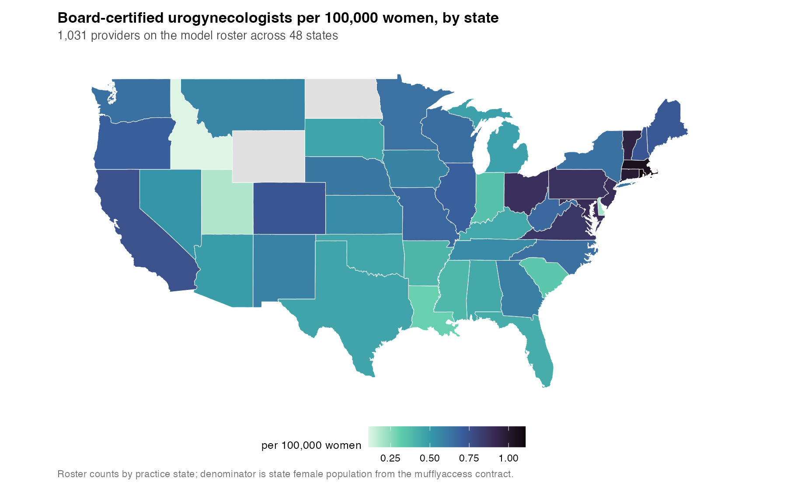

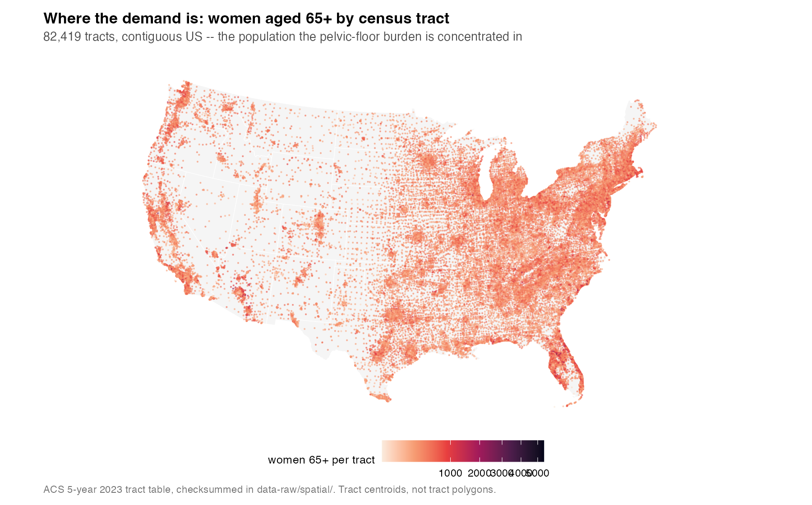

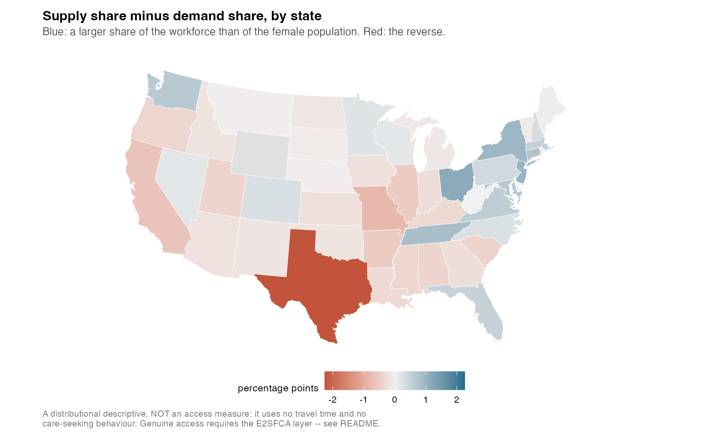

**Read these as descriptives, not as access.** They use administrative geography
and population counts — no travel time, no care-seeking behaviour, no capacity.
A state can look well supplied here and still have women three hours from a
urogynecologist. Genuine access requires the E2SFCA layer, whose travel-time
surface is now imported and verified but whose *barrier function* is not yet
validated (see flowchart 2).

---

## The two results worth reading

### Supply and demand over the horizon

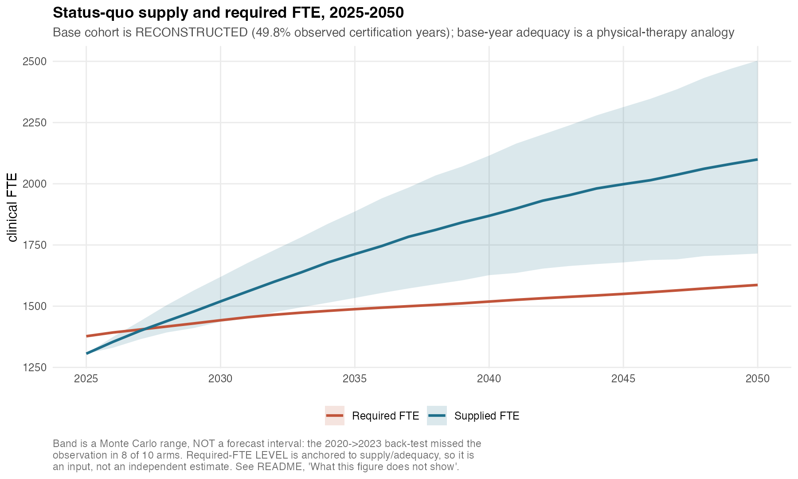

**What this figure does not show.** The band is a Monte Carlo range, not a
forecast interval — the 2020→2023 back-test missed the observation in 8 of 10
arms. And the required-FTE *level* is anchored to supply ÷ adequacy, so it is an
input rather than an independent estimate; only its *growth* comes from the
demand model.

### The entrant pipeline reconciles

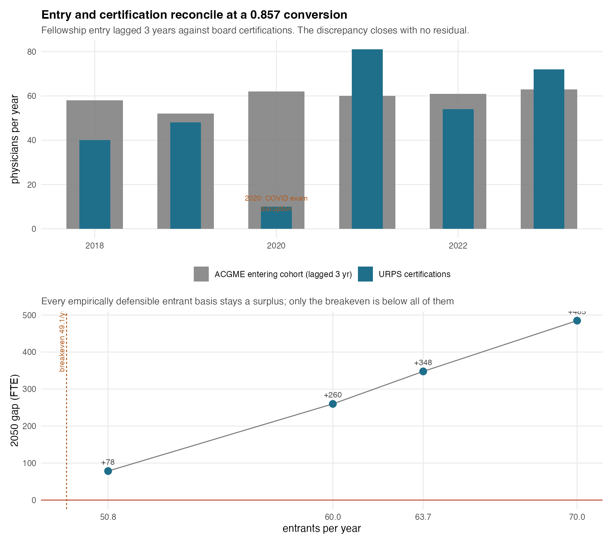

The apparent conflict between 70 NRMP-filled fellowship positions per year and
~51 board certifications per year is not a contradiction. Lag the entry cohorts
by the three-year fellowship and apply the observed conversion — **0.857 from
ACGME, 0.850 from NRMP, independently** — and the discrepancy closes with no
residual. Every empirically defensible entrant basis leaves a 2050 surplus; the
breakeven of 49.1/yr sits below all of them.

Reproduce all six panels with:

```bash
Rscript scripts/plot_readme_figures.R
```

---

## Orientation (start here)

**What question does this software answer?** Will the US supply of urogynecology /
reconstructive pelvic surgery providers keep pace with demand for pelvic-floor-
disorder care over the coming decades, and where will access fall short? It
projects provider **FTE supply** and **care demand** in the *same FTE units* and
reports the gap — with an uncertainty interval, by year and by geography.

**What inputs are required?** Nothing external for a first run: the supply engine
ships with bundled parameters, and `run_workforce_microsimulation_example.R`
produces a full projection in ~2 minutes. *Calibrated* results additionally need a
provider roster / certification counts (via the private `mufflyaccess` data
package), NRMP entrant counts, retirement hazards, and independent demand anchors
(HCUP, Medicare Part B, NAMCS/MEPS). Public input fixtures live in `inst/extdata/`;
uncalibrated coefficients are labelled as such and refuse to be reported as results.

**How is it different from a Markov model?** Partly it isn't — the disease side
(the dynamic multistate model, `R/29`–`R/31`) *is* a multistate model. The
difference is the **supply** side: it is agent-level, not compartmental. Each
provider is an individual carrying age, certification cohort, and career history,
so cohort effects, age-specific attrition, and late-career FTE decline are
represented directly rather than averaged into aggregate transition rates a Markov
chain cannot keep apart.

**How does it differ from a deterministic projection?** A deterministic projection
returns one line; this redraws the uncertain parameters and the provider cohort on
every iteration and returns a **distribution**. The headline deliverable is an
interval, not a point forecast — and, as our own validation shows
([`docs/RESULTS_INTERVAL_CALIBRATION.md`](docs/RESULTS_INTERVAL_CALIBRATION.md)),
that interval has to be judged by a proper scoring rule (width *and* miss), not by
coverage alone. Microsimulation is strongest when it communicates uncertainty, not
a single number — so the workforce gap is reported as a median, a prediction
interval, and decision-relevant probabilities (`workforce_gap_probabilities()`:
P(any shortage), P(shortage exceeds X%)), never as a single headline count.

**What has been validated?** Two different things, and it matters not to conflate
them. The *software* is fully validated: R CMD check passes clean and the test
suite (2,000+ assertions) runs on every commit. The *scientific forecast* is not
yet validated, and the package says so out loud. The 2020→2023 backtest found the
prediction intervals were not calibrated, and traced most of the miss to a
definition error (attrition on a cumulative count) and the rest to an entrant-rate
acceleration that was only visible after the fact
([`docs/RESULTS_INTERVAL_CALIBRATION.md`](docs/RESULTS_INTERVAL_CALIBRATION.md)).
What *is* validated on the forecasting side is the machinery to test it honestly
going forward: a leakage-free geographic hold-out, and a preregistered
(frozen + hashed) rolling-origin protocol that refuses to score a spec altered
after the targets were seen. Uncalibrated coefficients are labelled and refuse to
be reported as results.

**What publications support it?** The architecture follows the IHS Markit / Dall
**Health Workforce Microsimulation Model** and its applications (Zarek et al.
2025); the disease and obstetric-exposure inputs are drawn from the pelvic-floor
literature (Nygaard, Wu, Gyhagen, the Women's Health Initiative, SWAN — cited per
coefficient in `inst/extdata/` and `docs/DEMAND_METHODS.md`); forecast evaluation
uses the interval score (Gneiting & Raftery 2007) and the weighted interval score
(Bracher et al. 2021). The urogynecology model itself is **manuscript in
preparation** — not yet peer-reviewed — which is exactly why the validation
scaffolding above is being built before any headline claim is made.

*Deeper reading:* methods in [`docs/DEMAND_METHODS.md`](docs/DEMAND_METHODS.md),
the complete code map in [`docs/ARCHITECTURE.md`](docs/ARCHITECTURE.md) (every
module, the run data flow, and where to start reading), the validation record in
[`docs/BACKTEST_2020_TO_2023.md`](docs/BACKTEST_2020_TO_2023.md), and the
scientific-correctness benchmarks every commit must reproduce in
[`docs/BENCHMARKS.md`](docs/BENCHMARKS.md).

```r
# install.packages("pak")
pak::pak("mufflyt/simulation")
library(urpssim)
```

## Direct supply microsimulation

This is the minimal publication-safe supply run. It gives the 95% bands a
quantified entrant-rate component and calibrates the reference hours schedule to
the starting cohort. An empty `supply_parameter_spec()` does neither, and is
therefore refused in strict reproducibility mode.

```r
agents <- initialize_provider_agents(1306, "FPMRS", 2025)

entrant_history <- urps_certification_cohorts()
entrant_history <- entrant_history$n_certified[
  entrant_history$cert_year >= 2018
]

sim <- run_supply_microsimulation(
  initial_workforce   = agents,
  years               = 2025:2050,
  entrants_per_year   = 55,
  n_iterations        = 500,
  retirement_schedule = urps_empirical_retirement_schedule(),
  param_spec          = supply_parameter_spec(
    entrant_series = entrant_history,
    entrant_mean = 55
  ),
  fte_method          = "hours",
  hours_intercept     = calibrate_hours_intercept(agents$age)
)

sim$summary      # per-year median + 95% band
sim$iterations   # every replicate panel
```

The synthetic `agents` cohort is suitable for an example only. A
publication-facing run should use a validated provider roster with age and sex.

```bash
Rscript scripts/run_workforce_microsimulation_example.R   # no external data needed (~2 min)
Rscript scripts/run_backtest_2020_to_2023.R               # historical validation
Rscript scripts/run_demand_lifecourse_example.R           # life-course demand pathway
```

Logging goes through `base::message()`; there is no logging-package dependency.
`mufflyaccess` is in Suggests — the package checks and tests without it, and the
tests that need it skip themselves.

---

## Model architecture

```
┌─────────────────────────────────────────────────────────────────────┐
│                     DEMAND SIDE (HDMM)                              │
│                                                                     │
│  Census NPP ──► age-band female pop ──► D1 Prevalent PFD cases     │
│  (2023 mid/lo/hi)    (5 bands)          D2 New consultations        │
│                                         D3 SUI+POP surgical volume  │
│  BRFSS 2023 ──► population cells ──►   D4 BRFSS UI care-seeking    │
│  (229k women)   (age×race×ins×income)   (survey-weighted prevalence)│
│                                                                     │
│  Reproductive life-course pathway:                                  │
│  vaginal births → PFD risk → care-seeking → referral → visits      │
│                          ▼                                          │
│               service volumes × wRVU basket                         │
│                          ▼                                          │
│              required FTE (solved, not assumed)                     │
└─────────────────────────────────────────────────────────────────────┘
                               │
                    SUPPLY/DEMAND GAP
                     (FTE on both sides)
                               │
┌─────────────────────────────────────────────────────────────────────┐
│                     SUPPLY SIDE (HWSM)                              │
│                                                                     │
│  Provider roster ──► Fraher agent cohort (n≈1306)                  │
│  (ABOG + ABU)         age × sex × census division                   │
│                              ▼                                      │
│  Each annual step:   Weibull survival curve ──► exit draw          │
│                      HRSA hours by age/sex ──► clinical FTE        │
│                      migration matrix ──────► geography             │
│                      +new fellows ──────────► entrant draw          │
│                              ▼                                      │
│              effective supplied FTE (MC median + 95% PI)            │
│                                                                     │
│  Scenario levers: entrant rate / Weibull scale (±2 yr) / hours     │
└─────────────────────────────────────────────────────────────────────┘
```

### Demand pipeline (D1–D4)

```
Census NPP female population (5 age bands, 2025–2050)
    │
    ├─ × PFD prevalence (Nygaard 2008, age-specific)  ──► D1 prevalent cases
    │
    ├─ × consult rate (Kirby 2013, age-specific)       ──► D2 new consultations
    │
    ├─ × surgery rate/1000 (Wu 2011, age-specific)     ──► D3 SUI+POP procedures
    │
    └─ × BRFSS UI prevalence × care-seeking × referral ──► D4 survey-weighted

All four ──► assert_estimands_independent() ──► concordance assessment
D2 + D3 ──► service basket × wRVU ──► required FTE
```

### Supply pipeline

```
ABOG+ABU roster (aggregate counts, 2023)
    │
    └─► certification cohorts ──► Fraher agent table
            651 recent (2014-2023, mean age 39.5)
            655 legacy  (≤2013, mean age 54.4)
                    │
         ┌──────────┴──────────┐
         ▼                     ▼
  Annual advance:         Weibull retirement curve
  age += 1                  shape ~ 2.0, scale ~ 68–70
  HRSA FTE weight           scenarios shift scale ±2 yr
  migration draw
  new entrant draw
         │
         └──► effective_fte (n_active × mean_clinical_fte)
```

---

## The rules this model enforces

**1. The base-year shortfall is estimated, never assumed — and it says whose
data it came from.** Rebasing supply and demand to 1.0 in the base year
guarantees adequacy of 1.0 whether or not the workforce is short. The HWMM
documentation names this as a conceptual limitation: base-year equilibrium
*"essentially presents future adequacy relative to current levels."*
`R/reporting-baseline_gap.R` implements four routes — a provider capacity survey,
HPSA-removal counts, an external anchor, or a labelled assumption with an
evidence ledger. Without one, `REPRODUCIBILITY_MODE=strict` refuses to run.

Every gap object also carries a `calibration_status` separate from its `method`,
because the method names only the arithmetic. Zarek's instrument fielded on
urogynaecologists and Zarek's published physical-therapy distribution borrowed
wholesale produce identical output, and the base-year shortfall passes through to
the headline gap **with a coefficient of one** — so a borrowed number must not be
reportable as a measurement. `baseline_gap()` refuses to guess the tier for any
method but `assumed`, and `validation_report()` reports `base_year_gap_estimated`
and `base_year_gap_measured` as two separate checks.

**2. Every supply/demand comparison has FTE on both sides.** Provider FTE divided
by a count of prevalent cases, consultations, or procedures is dimensionally
meaningless. `R/supply-workload_to_fte.R` converts service volumes to required FTE
through work RVUs calibrated to a base-year anchor. `compute_demand_coverage()`
now errors with an explanation.

**3. FTE is an hours threshold, and hours vary by age *and* sex.** Not a
hand-picked productivity step function. Thresholds are not comparable across
studies (37.2 / 40 / 42.3 / 70 clinical hrs/wk in the four source models), so
`restate_fte()` exists to convert between them.

**4. Retirement scenarios shift the Weibull scale, not a binary year.** Each
provider exits at a draw from a Weibull survival curve (shape ≈ 2.0, scale ≈
68–70 by sex/board). Scenarios shift the scale parameter (±2 yr = scale ± 2),
preserving the stochastic shape of the curve. The legacy ±2 yr deterministic
shift is available for comparison but fails `assert_survival_curve_used()` in
strict mode. The scenario validator rejects a `hazard_mult` field outright.

**5. Reported intervals must carry forecast uncertainty.** The engine redraws
parameters each Monte Carlo iteration. Running with fixed parameters is refused
in strict mode, because the back-test showed such intervals are 6.5–8.2× too
narrow.

---

## The NAMCS calibration scalar, and what 0.963 means

The model predicts office-visit demand from disease burden and care pathways.
Nothing internal tells you whether that prediction is the right size. A
calibration scalar is the external check:

```
scalar = independent national estimate / model prediction
```

The NAMCS anchor is **4,814,760** pelvic-floor-related office visits (NAMCS 2019
Public Use File, CI 1,982,987–7,646,533). Against a base-year prediction of
5,000,000 that gives a scalar of **0.963** — the model runs about **3.7% high**,
which is close agreement.

**How to read the number.** A scalar near 1 means the model and an independent
source agree on magnitude. A scalar far from 1 signals a **structural
mismatch**, not an offset to divide out — the published HDMM scalars in
`config/calibration_targets.yml` make the point (Ob/Gyn 0.906, Urology 0.728,
Orthopaedic Surgery 0.243). A value like 0.243 says the model and the anchor are
counting different things. `max_scalar: 3.0` flags anything beyond threefold as
structural rather than calibratable.

**What the anchor is, precisely.** Any of `DIAG1`–`DIAG3` beginning with an
ICD-10-CM prefix in `URPS_ICD10_PREFIXES`: `N393`, `N394`, `N81`, `N3281`,
`R32`, `N993`, `N994`. Weighted contributions:

| Prefix | Meaning | Weighted visits |
|---|---|---|
| `N394` | other specified UI | 2,461,101 |
| `R32` | unspecified UI | 2,047,284 |
| `N81` | female genital prolapse | 1,856,110 |
| `N393` | stress UI | 462,053 |
| `N993` | vault prolapse after hysterectomy | 104,062 |
| `N994` | post-procedural pelvic adhesions | 73,146 |
| `N3281` | overactive bladder | **0** |

(These sum above the anchor because a visit can carry several qualifying
diagnoses; the anchor de-duplicates at visit level.)

**Two findings from the clinical review, recorded and non-blocking.** `N99.4` is
adhesive disease, not pelvic floor dysfunction, so it is arguably out of scope —
but at ~1.5% it sits far inside the CI. `N32.81` is documented as included and
matches **zero** visits, so the overactive-bladder inclusion is inert. Neither
can change the estimand, which is why neither blocks under the governing rule
(below). `N39.0` (UTI) is correctly excluded.

**What it is not.** NAMCS is **office-based only** — it excludes hospital
outpatient departments and the ED — so the anchor is a **structural lower bound**
for all-setting ambulatory demand. It is all-provider and condition-defined, not
FPMRS-specialist visits. Do not average or blend it with the MEPS 2023 figure
(9,063,442); that uses a different visit frame.

**Why this anchor is approved while others are not.** Clinical review attaches
to each anchor's own estimand dependencies:

> An anchor is blocked only by unresolved assumptions that can change **that
> anchor's** estimand.

NAMCS does not use the urogynaecologic procedure-family definitions, so the CHIA
procedure review does not block it. `prolapse_procedure_volume` and
`ui_prevalence` remain pending on their own definitions.
`assert_anchor_reviewed()` enforces exactly the scope each anchor names.

## Medicare sling-activity comparison

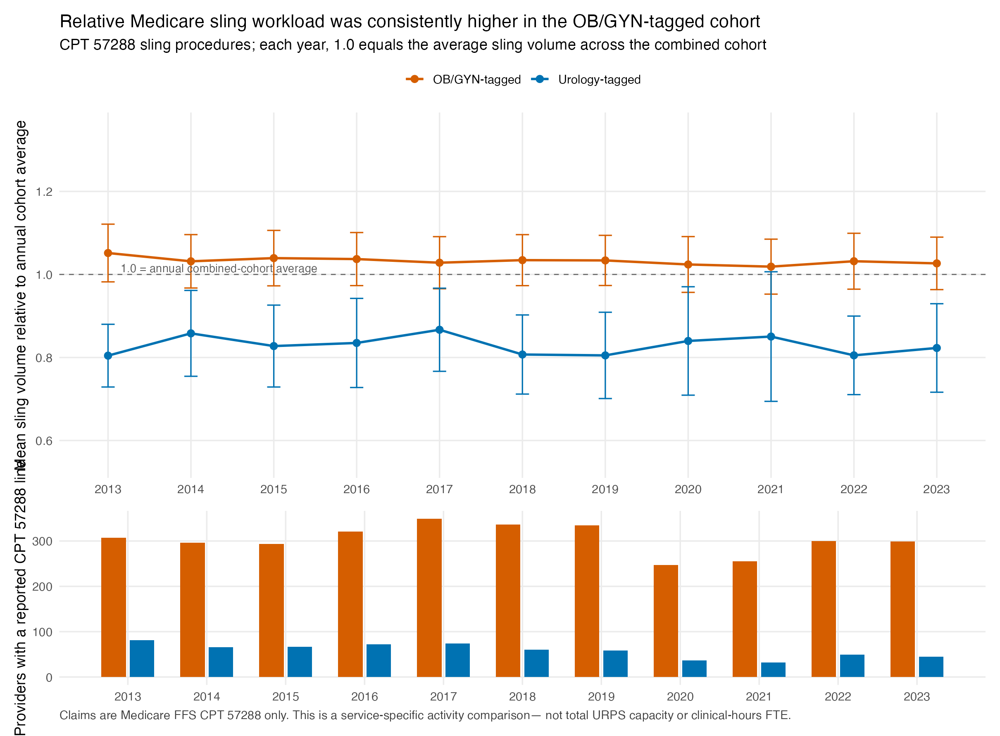

This figure uses the Medicare fee-for-service cache for **CPT 57288** (sling
procedures), not a complete URPS claims file. Within each year, 1.0 is the
average sling volume across the combined observed cohort. The lower panel shows
the number of clinicians with a reported CPT 57288 line. It is a service-specific
activity comparison—not total URPS capacity, all-payer productivity, or
clinical-hours FTE.

Rebuild it when the external drive is mounted:

```bash
Rscript scripts/plot_medicare_sling_workload.R
```

Set `MEDICARE_SLING_CACHE` to use another `provider_volume.rds` location and
`MEDICARE_SLING_FIGURE` to choose a different output path.

## Medicare realized-care trajectories

> **Figure generated locally.** This panel is not committed: it requires the
> ~2.7 GB/year raw Medicare provider-service files, which are licensed and stay
> out of the repository. Build it with the command below, then
> `figures/medicare_realized_care_2013_2016.png` appears here.

This is a separate **realized-care** validation series: annual Medicare
fee-for-service procedure counts in the URPS CPT basket. It is not a prevalence
estimate, total clinical capacity, or latent all-payer demand. Generic E/M visit
codes are excluded because the Provider-and-Service PUF has neither diagnosis
codes nor beneficiary age; it cannot tell whether a 99213 line was for pelvic
floor care. Low-volume PUF lines are also suppressed by CMS.

[`scripts/plot_medicare_realized_care.R`](scripts/plot_medicare_realized_care.R)
documents the full workflow: it derives years from CMS filenames, filters the
multi-gigabyte CSV files with DuckDB before collecting records into R, maps only
procedure-specific HCPCS codes through `urps_medicare_service_crosswalk()`,
writes a checksum-protected RDS artifact, exports national totals, and renders
the faceted trend plot. To reproduce the figure shown above from the mounted
external drive:

```bash
MEDICARE_PROVIDER_SERVICE_DIR="$SLING_DATA_ROOT/sling-volume-patterns/data/raw" \
MEDICARE_REALIZED_CARE_OUTPUT_DIR="figures" \
MEDICARE_REALIZED_CARE_YEARS="2013,2014,2015,2016" \
MEDICARE_REALIZED_CARE_PREFIX="medicare_realized_care_2013_2016" \
Rscript scripts/plot_medicare_realized_care.R
```

For all available years, omit `MEDICARE_REALIZED_CARE_YEARS`. On a laptop, use
small year batches (for example `2017,2018`) because each raw annual file is
about 2.7 GB; the batch output remains provenance-tagged and can be combined
only after preserving its payer-scope label.

## Exploratory model outputs and mechanics

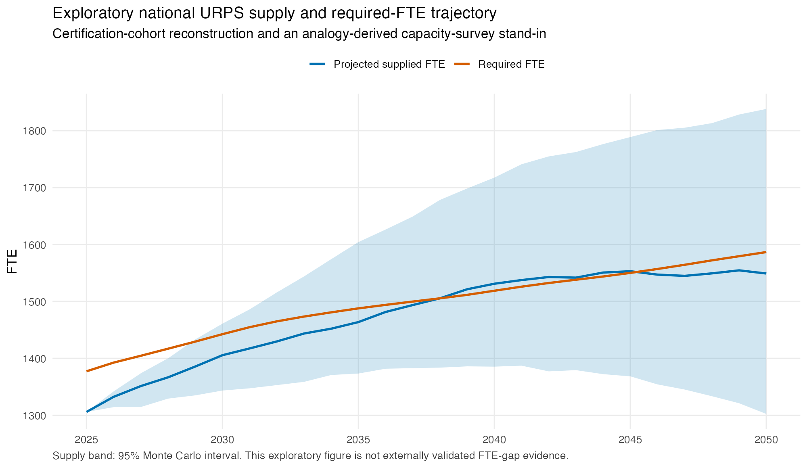

This status-quo trajectory shows the model's intended output: supplied and
required workforce expressed in the same FTE units. It is **exploratory** because
the starting population is reconstructed from certification cohorts and the
baseline adequacy uses an analogy-derived capacity-survey stand-in. It should not
be read as externally validated FTE-gap evidence.

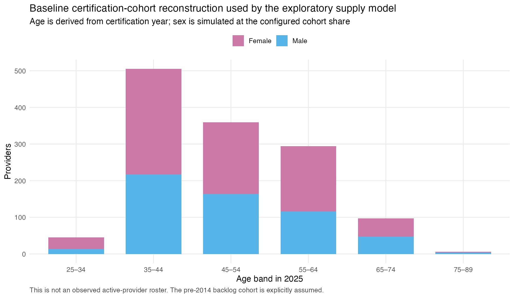

The baseline supply cohort is reconstructed from certification years. Fellowship
cohort ages are derived from their certification years, the pre-2014 backlog is
assumed, and sex is simulated at the configured share. This is deliberately not
presented as an observed active-provider roster.

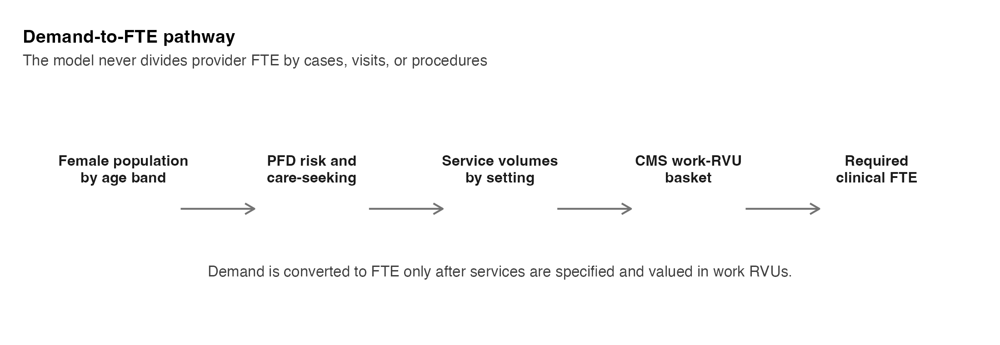

The demand path keeps the units explicit: population and care-seeking are first
translated to services, then to work RVUs, and only then to required clinical
FTE. This prevents dimensionally invalid ratios such as providers per case.

Rebuild these figures with:

```bash
Rscript scripts/plot_readme_model_overview.R
```

### Condition-specific service pathway

UI, prolapse and anal incontinence have always been modelled separately — the
model has never used one pooled "PFD demand" rate. What was missing was pathway
*structure*: the old service map was a flat annual rate per treated patient, so a
UI patient contributed PTNS and a sling in the same year as independent draws,
and nothing generated post-operative follow-up or recurrence at all.

`R/demand-condition_service_pathway.R` replaces that with an explicit cascade —
conservative → testing → procedure → follow-up → recurrence — where each stage
carries one `p_advance` and the entrants to stage *k+1* are the entrants to stage
*k* times that probability.

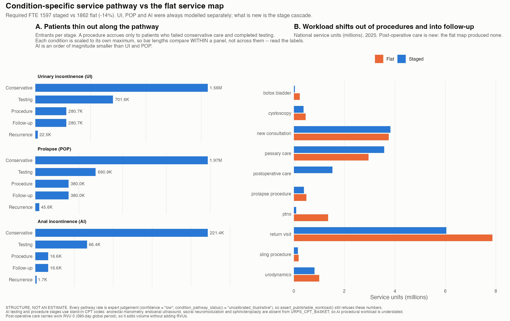

Panel A is the cascade: a procedure accrues only to patients who failed
conservative care **and** completed testing. Each condition is scaled to its own
maximum, so bars compare within a panel, not across — AI is an order of magnitude
smaller than UI and POP. Panel B is what that does to service volume: procedures
thin out while `postoperative_care` appears for the first time.

Every number in this section comes from one reproducible run — the synthetic
illustrative population defined in the plot script (ages 40–85,
`2e6 * exp(-0.02 * (age - 40))`), `n = 5e4`, `seed = 1`, year 2025, both arms on
the same seed so they differ only by the pathway argument. Regenerate and check
with the command below; these are **not** production figures and do not use the
Census-NPP series:

| Quantity | Flat | Staged | Ratio |
|---|---:|---:|---:|
| PTNS service units | 1,358,052 | 95,820 | 0.071× |
| Botox (bladder) units | 233,878 | 42,098 | 0.180× |
| `postoperative_care` units | 0 (never generated) | 1,527,937 | — |
| Required clinical FTE | 1,862.0 | 1,596.7 | −14.2% |

**This figure shows structure, not a workforce estimate.** Every pathway rate is
expert judgement (`confidence = "low"`), so `condition_pathway_status()` returns
`"uncalibrated_illustrative"` and `assert_publishable_workload()` still refuses
these numbers. Two AI stages use stand-in CPT codes because anorectal manometry,
endoanal ultrasound, sacral neuromodulation and sphincteroplasty are absent from
`URPS_CPT_BASKET`, so AI procedural workload is understated.

Rebuild it with:

```bash
Rscript scripts/plot_condition_service_pathway.R
```

## Care seeking is estimated, not assumed

Prevalence does not create demand — care seeking does. That step used to be two
hard-coded constants (`CARE_SEEKING_BY_INSURANCE`, `CARE_SEEKING_BY_INCOME`).
`R/data-meps_care_seeking.R` estimates it instead, from MEPS 2023, as the two-part
structure the quantity actually has: **P(any pelvic-floor ambulatory visit)**,
and **visits given that care was sought**. Both are survey-weighted
(`VARPSU`/`VARSTR`/`PERWT23F`); expected visits per woman is their product.

Pelvic-floor visits are office-based events (HC-248G) linked through the
condition and condition–event files to ICD-10 `N39`/`N81`/`R32`/`R15`. The 2023
analytic sample is **8,123 adult women carrying 299 care-seeking events**, a
weighted rate of **3.33% of adult women per year**.

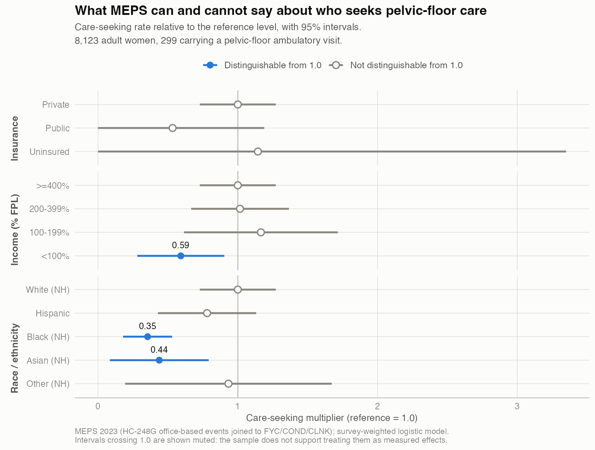

The sample identifies three gradients and cannot identify the rest, which is the
point of the figure: intervals that cover 1.0 are drawn muted.

| Effect | Multiplier | 95% interval | Identified |
|---|---|---|---|
| Income < 100% FPL | 0.59 | 0.28 – 0.90 | yes |
| Non-Hispanic Black | 0.35 | 0.18 – 0.53 | yes |
| Non-Hispanic Asian | 0.44 | 0.08 – 0.79 | yes |
| Uninsured | 1.14 | 0.00 – 3.35 | **no** |
| Public insurance | 0.53 | 0.00 – 1.19 | **no** |

Two consequences. **The shipped uninsured multiplier of 0.58 is not supported by
these data** — its interval runs from 0 to 3.35, so the estimate cannot be
distinguished from no effect in either direction, and replacing an assumed
constant with an unidentified estimate would be no improvement. And the effects
the data *do* identify — income and race/ethnicity — are gradients the demand
model does not currently carry at all.

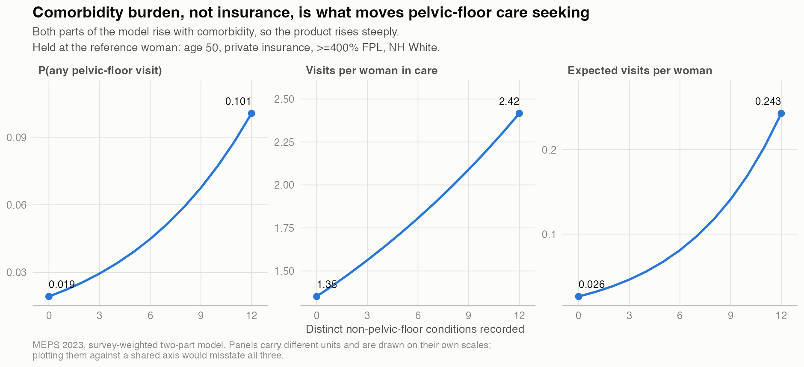

Comorbidity burden is the strongest predictor, and it moves **both** parts:
across 0 → 12 recorded conditions, P(any visit) rises 0.020 → 0.104 and visits
per woman in care rise 1.40 → 2.52, so expected visits per woman rise **0.027 →
0.263, a factor of 9.6**. A single care-seeking rate cannot represent that,
because it cannot separate "more women enter care" from "each woman is seen more
often".

Every number above is regenerated, with its interval, into
`data-raw/meps/meps_2023_care_seeking_manifest.txt` by:

```bash
Rscript scripts/plot_meps_care_seeking.R
```

That script's header documents the file lineage, the model specification, and
why each figure takes the form it does.

## Historical validation

`docs/BACKTEST_2020_TO_2023.md` — fit on information available through 2020 only,
project 2021–2023, score against an observed count the model never saw. Leakage
is prevented mechanically: every contract read is audited and
`assert_no_leakage()` fails if any read reached the validation window.

**The back-test failed in all eight arms.** The best arm predicted **1,195
against an observed 1,306 (−8.5%)**, and the observed value fell outside the 95%
interval everywhere. Two distinct causes, both reported honestly:

- Certification more than doubled in the unseen window (40/48/**10** per year
  pre-cutoff against 81/54/72 after). No model fitted on 2018–2020 could
  anticipate a COVID trough followed by backlog clearance.
- The intervals were far too narrow. Adding parameter uncertainty widened them
  3.7× and improved coverage from ~6.5× too narrow to ~1.7×, **without moving the
  point estimate** — but it still does not cover. The residual is structural
  break, not sampling error.

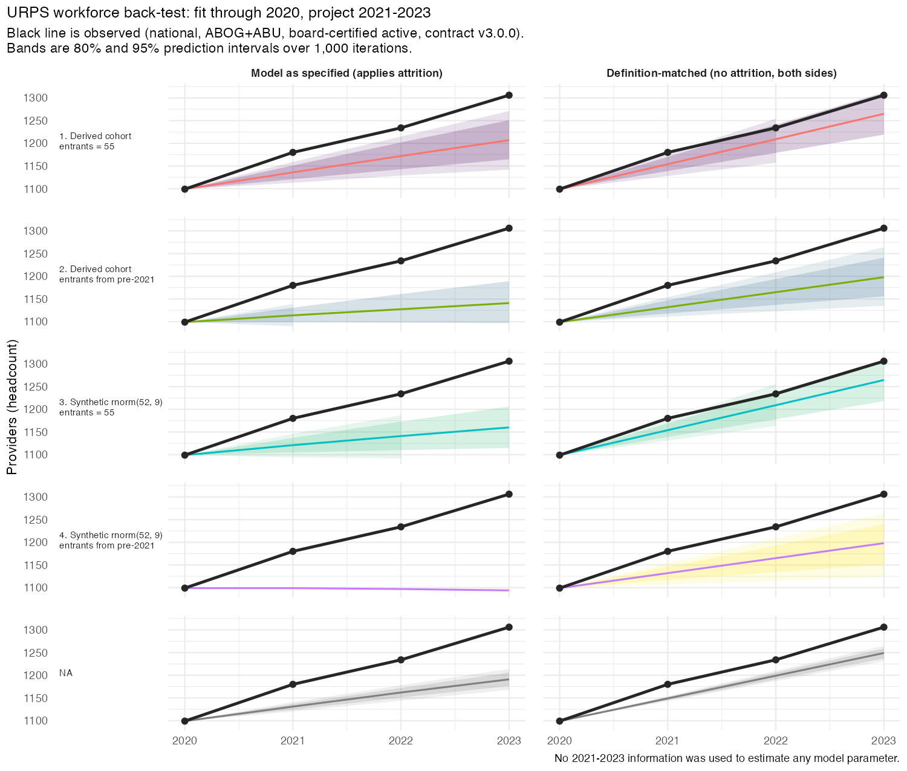

The figure makes the limitation visible: the observed 2021–2023 count falls
outside every model arm's 95% prediction interval. It is a headcount back-test;
it does not validate clinical-hours FTE, required FTE, or the projected gap.

### Rolling-origin interval coverage

`R/validation-interval_coverage.R` implements a rigorous leave-future-out coverage
assessment. Rather than a single train/test split, `rolling_origin_coverage()`
replicates the forecast problem across all available origin windows and measures
empirical interval coverage:

```
observed series:  2012 2013 2014 2015 2016 2017 2018 2019 2020 2021 2022 2023
fold 1 train: ────────────────────────────────────────────────
              └─── fit through 2017 ───┘ predict 2018-2020 → scored

fold 2 train: ───────────────────────────────────────────────────────
              └─── fit through 2018 ────┘ predict 2019-2021 → scored

fold 3 train: ──────────────────────────────────────────────────────────────
              └─── fit through 2019 ─────┘ predict 2020-2022 → scored
```

`solve_interval_inflation()` finds the smallest inflation factor such that
empirical coverage reaches the nominal level. `assert_interval_coverage_publishable()`
gates on ≥3 folds and a coverage ratio below a ceiling before results may be
reported.

### What the back-test did *not* test

It scored **headcount only**. The deliverable is `fte_gap`, and three of its four
components were never validated:

| Component | Back-tested? |
|---|---|
| Provider headcount | **yes** — −8.5%, outside the 95% interval |
| headcount → supplied FTE | no — the hours schedule is `derived_by_analogy` |
| Required FTE | no |
| The gap itself | no |

---

## Which inputs actually move the answer

Because `wrvu_per_fte` is *solved* against the base-year anchor, several inputs
that look alarming cancel out. Measured, not asserted — `test-workload-to-fte.R`
locks each of these:

| Perturbation | Effect on required FTE |
|---|---|
| All service volumes ×2 or ×0.5 | **exactly none** — bit-identical |
| Uniform 20% cut to every URPS delegation share | **exactly none** |
| Tripling one service (mix shift) | ≤ 0.91% on 25-year growth |
| Base-year adequacy 0.948 → 1.000 | **4.4 pp** on the 2050 gap |
| Donor specialty for base-year adequacy (PT → physiatry) | **71 → 155 FTE** base-year shortfall |
| Supply error of −8.5% (the back-test's) | **6.7 pp** on the 2050 gap |
| Weibull scale ±2 yr (retirement scenario) | **~3–5 pp** on 2050 FTE |

---

## Calibration status

Every input carries one of four tiers, reported by `calibration_status_report()`
and enforced by `assert_publishable_workload()`:

| Tier | Meaning | Gate |
|---|---|---|
| `calibrated` | anchored to an external published source | passes |
| `solved` | determined by an internal constraint, not assumed | passes |
| `derived_by_analogy` | structure from a published study in **another specialty** | needs `allow_analogy = TRUE` |
| `uncalibrated_illustrative` | placeholder | always refused |

| Input | Tier | Source |
|---|---|---|
| Work RVUs | `calibrated` | CMS PFS Relative Value File, RVU25A (2025) |
| Demand population | `calibrated` | US Census 2023 National Population Projections |
| BRFSS UI prevalence (D4) | `calibrated` | CDC BRFSS 2023 (229,541 women, survey-weighted) |
| PFD prevalence 65+ | `calibrated` | `mufflyaccess::pfd_prevalence()` |
| Indirect time share (0.271) | `calibrated` | AAN 2010 Practice Profile, n = 910 |
| Base-year supply | `calibrated` | `mufflyaccess` URPS contract |
| Hours intercept | `solved` | set so the base-year cohort mean equals 37.2 clinical hrs/wk |
| Productivity (wRVU/FTE) | `solved` | solved from the base-year anchor; **plausibility-checked** |
| Weibull retirement shape | `derived_by_analogy` | HWSM Exhibits 17–18 (general physician curves) |
| Service case mix | `derived_by_analogy` | declared CPT mix; replace with claims-derived shares |
| Delegation shares | `derived_by_analogy` | Forte 2021 physiatry shape, level rescaled |
| Clinical hours schedule | `derived_by_analogy` | HWSM Exhibit 14 (general internal medicine levels) |
| Base-year adequacy | `derived_by_analogy` | Zarek 2025 PTJ physical-therapy capacity distribution |
| PFD prevalence < 65 | local | not in the contract; Nygaard-derived literals |

The base-year gap carries its tier on the gap object itself
(`BASELINE_GAP_TIERS`, `R/reporting-baseline_gap.R`), which adds
`assumed_with_evidence` for the Dall 2013 route — an assumption defended by
indirect indicators — and drops `solved`, since no internal constraint can
determine a base-year shortfall. `assert_baseline_gap_estimated()` accepts
`calibrated`, requires `allow_analogy = TRUE` for the middle two tiers, and
refuses `uncalibrated_illustrative` outright.

---

## Module map

The 82 modules in `R/` are grouped into nine conceptual families (`core-`,
`supply-`, `demand-`, `geography-`, `reporting-`, `calibration-`, `validation-`,
`data-`). **[`docs/ARCHITECTURE.md`](docs/ARCHITECTURE.md) is the complete map** —
every file with its purpose, the run data flow, the contract boundary, and
reading paths. The table below is a curated subset of the load-bearing modules.

| Module | Contents |
|---|---|
| `core-paths.R` | external-data path resolution (no hardcoded paths anywhere) |
| `core-repro_provenance.R` | reproducibility modes, seeding, fail-closed artifact provenance |
| `core-canonical_and_joins.R` | canonical source resolver, join-safety wrappers |
| `supply-provider_microsimulation.R` | stochastic supply engine + `participation_logistic` FTE method |
| `demand-urps.R` | D1/D2/D3 demand estimands; `compute_brfss_demand_estimand()` (D4) |
| `demand-obstetric_exposure.R` | birth-cohort vaginal parity, obstetric-exposure estimand |
| `geography-spatial_access_e2sfca.R` | E2SFCA / M2SFCA geographic access |
| `core-run_workforce_microsimulation.R` | main orchestrator; `brfss_cells` wires in D4 |
| `supply-provider_lifecycle.R` | roster contract, hours by age × sex, retirement, career change |
| `supply-workload_to_fte.R` | service basket, delegation matrix, workload → FTE |
| `reporting-baseline_gap.R` | base-year supply adequacy |
| `reporting-scenario_registry.R` | versioned supply and demand scenarios |
| `geography-provider_geography.R` | empirical-Bayes migration matrix, origin-dependent placement |
| `calibration-validation.R` | calibration scalars, two-method agreement, validation report |
| `core-legacy_loader.R` | ordered, collision-reporting loader for `inst/legacy/` |
| `data-cms_rvu.R` | CMS work RVUs, CPT basket, re-derivation helpers |
| `core-ssot.R` | every `mufflyaccess` contract hookup, in one place |
| `demand-lifecourse.R` | reproductive life-course demand pathway |
| `demand-utilization_models.R` | survey-weighted utilization and offset-Poisson rate models |
| `demand-lifecourse_uncertainty.R` | life-course demand prediction intervals |
| `calibration-demand_lifecourse.R` | life-course anchoring to national totals |
| `demand-dynamic_multistate.R` | multistate PFD transition model |
| `demand-dynamic_open.R` | open-cohort dynamic demand |
| `demand-dmdm_fit_transitions.R` | multistate transition fitters |
| `geography-demand.R` | geographic demand apportionment |
| `supply-roster.R` | base-year cohort from the observed certification series |
| `validation-backtest.R`, `validation-backtest_run.R` | leakage-free historical back-test |
| `calibration-parameter_uncertainty.R` | per-iteration parameter draws for the supply engine |
| `calibration-sources.R` | empirical `cliff` hazards, NRMP entrants, age-productivity curve |
| `validation-backtest_status.R` | back-test status reporting |
| `supply-retirement_hazard.R` | `build_urps_exit_hazard()` — Gompertz fit from cliff or Fraher fallback |
| `calibration-hrsa_fte.R` | `apply_hrsa_surgical_fte()` — HRSA hours by age/sex → relative FTE |
| `validation-interval_coverage.R` | rolling-origin coverage, interval inflation solver, publication gate |
| `data-swan_incontinence_panel.R` | SWAN visit harmonisation, evidence-gated crosswalk (DAYSLEA/LEKDAYS) |
| `demand-severity_sandvik.R` | Sandvik Incontinence Severity Index (frequency × amount) |
| `data-urps_population.R` | HWMM-style population file: BRFSS cells, DEMAND_AGE_BAND crosswalk, D4 prevalence weights |
| `reporting-workforce_concentration.R` | Herfindahl index and geographic concentration |
| `demand-pop_transitions.R` | population transition helpers |
| `supply-fraher_agent_supply.R` | Fraher (2024) individual-level agent engine; `initialize_urps_agents()`, `advance_urps_agents()` |
| `supply-urps_flows.R` | URPS patient flow functions for demand modeling |
| `demand-prevention.R` | DPMM-lite: conservative management diversion multipliers (PT / pessary) |
| `supply-partial_pooling_hazard.R` | empirical-Bayes partial pooling for sparse hazard cells |
| `calibration-psa.R`, `calibration-psa_workforce.R` | joint Monte-Carlo + PRCC/SRRC global sensitivity analysis |

> Add new files inside an existing conceptual family (`supply-`, `demand-`, …)
> and **never** reintroduce a numeric prefix — parallel branches each taking
> "the next number" is how four modules previously collided.

---

## Single source of truth

`mufflyaccess` owns several quantities this package must not redefine.
`ssot_coverage_report()` lists what is owned and what is local.

| Quantity | Function |
|---|---|
| Base-year supply | `urps_count()` — national 1,306 / CONUS 1,303 (2023, ABOG+ABU) |
| Supply scenarios | `urps_scenarios()` v1.0.0 — 9 registered ids |
| Projection output shape | `urps_projection_schema()`, validated on export |
| PFD prevalence 65+ | `pfd_prevalence()` |
| Drive-time bands | `get_canonical_bands()` |
| Rurality | `rurality_from_ruca()` (RUCA ≥ 4 is rural) |
| Artifact provenance | `urps_provenance()`, folded into the run manifest |

---

## The base-year cohort

The contract ships **aggregate counts only** — no age, sex or state, with
`n_retired = 0` in every row — so a real roster must still come from outside it.
Two populations sit inside the 2023 total of 1,306:

| | n | Share | Mean age | Basis |
|---|---:|---:|---:|---|
| Certified 2014–2023 | 651 | 49.8% | 39.5 | **Observed** — fellowship graduates |
| Certified by 2013 | 655 | 50.2% | 54.4 | **Assumed** — initial backlog clearance |

`cohort_provenance()` refuses to call the result a roster. `initialize_urps_agents()`
builds the Fraher-style agent table from these two sub-cohorts with realistic
age × sex × census-division distributions.

---

## Retirement modeling

Retirement is drawn from a **Weibull survival curve** (`R/supply-fraher_agent_supply.R`,
`R/supply-retirement_hazard.R`), not a binary age-shift:

```
P(still active at age a) = exp(−(a / scale)^shape)

ABOG female:  shape ≈ 2.1,  scale ≈ 68.5  (peak exit ~65–67)
ABOG male:    shape ≈ 1.9,  scale ≈ 70.2
ABU mixed:    shape ≈ 2.0,  scale ≈ 66.0  (mixed urology practice exits earlier)
```

Scenario levers shift the `scale` parameter (±2 yr = scale ± 2), which moves
the median retirement age while preserving the stochastic spread of the curve.
The cliff DuckDB, when available, fits the shape and scale from observed ABOG
departure events; otherwise the published HWSM Exhibit 17–18 analogy values are
used with `derived_by_analogy` tier.

```
Survival probability by age (schematic):

P(active)
1.0 ┤
    │▓▓▓▓▓▓▓▓▓▓▓▓▓
0.8 ┤             ▓▓▓▓
    │                 ▓▓▓
0.6 ┤                    ▓▓
    │                      ▓▓
0.4 ┤                        ▓▓
    │                          ▓▓
0.2 ┤                            ▓▓▓
    │                               ▓▓▓▓
0.0 ┤                                   ▓▓▓▓▓▓
    └───┬───┬───┬───┬───┬───┬───┬───┬───┬───┬─▶ age
       40  45  50  55  60  65  70  75  80  85

    ── baseline (scale=68.5)
    ·· early retirement (scale=66.5, −2 yr)
    ── delayed retirement (scale=70.5, +2 yr)
```

---

## BRFSS population cells (D4)

`R/data-urps_population.R` implements the HWMM population-file architecture:

```
BRFSS 2023 (229,541 women 18+, survey-weighted)
    │
    └─► build_urps_population_cells()
         │
         ├─ age_group × race_eth × insurance × income_tier × metro × bmi_class
         ├─ pop_weight (sum of survey weights ∝ US population)
         ├─ pct_smoker, mean_children
         └─ ui/pop/fi prevalence (observed or Nygaard 2008 imputed)
                    │
         brfss_pfd_prevalence_for_demand_bands()
                    │  crosswalk: URPS bands → DEMAND bands
                    ▼
         compute_brfss_demand_estimand()
                    │  × care_seeking_rate × referral_rate × NPP population
                    ▼
              D4 time series (2025–2050)

DEMAND_AGE_BANDS crosswalk (approximate, year-width splits):
  "20-39" ← "18-34" (1.0)
  "40-59" ← "35-44" (0.5) + "45-64" (0.75)
  "60-64" ← "45-64" (0.25)
  "65-79" ← "65-74" (1.0)
  "80+"   ← "75+"   (1.0)
```

The BRFSS 2023 core file does not include the state-optional UI/POP/FI module
(BLADCON/URINCON). `build_calibrated_population_cells()` therefore blends
nationally weighted NHANES UI prevalence into the BRFSS demographic cells when
the NHANES acquisition output is available; it records this explicitly as
`ui_source = "nhanes_2017_2023_pooled"` and
`pfd_source = "mixed_nhanes_ui_nygaard_wu"`. BRFSS still supplies the
survey-weighted BMI, smoking, income, insurance, and geographic composition;
POP and FI retain their separately documented published inputs until comparable
observed national data are wired.

---

## Prevention model (DPMM-lite)

`R/demand-prevention.R` applies conservative-management diversion multipliers to
service volumes before `convert_workload_to_fte()`, following the IHS Markit
DPMM architecture:

```
service_volumes (from example_service_volumes or lifecourse_demand_trajectory)
    │
    └─► apply_prevention_multipliers(ui_uptake, pop_uptake)
         │
         ├─ diverted UI patients: no sling, no consultation → pessary_care or ptns
         └─ diverted POP patients: no prolapse procedure, no consultation
                    │
              net service volumes → wRVU → required FTE
```

A higher `ui_uptake` reduces surgical demand but creates conservative-care visit
volume. The net FTE effect depends on the relative wRVU weights of surgery vs.
conservative care.

---

## Scientific integrity: what a green build means

One required check, `scientific-integrity`, gates `main`. It is the aggregator
for every executable scientific contract in the package, and it exists because
"all tests pass" was not a strong enough claim:

> No plausible code change can alter who exists, when they exist, which data
> created that decision, or the published result, without CI noticing.

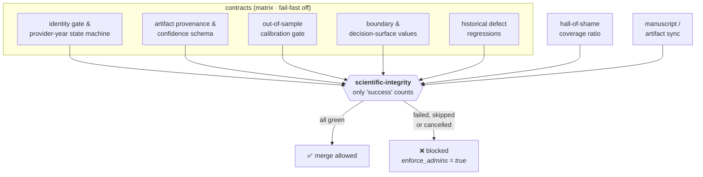
```mermaid
flowchart TD
    subgraph M["contracts (matrix · fail-fast off)"]
        A["identity gate &<br/>provider-year state machine"]
        B["artifact provenance &<br/>confidence schema"]
        C["out-of-sample<br/>calibration gate"]
        D["boundary &<br/>decision-surface values"]
        E["historical defect<br/>regressions"]
    end
    F["hall-of-shame<br/>coverage ratio"]
    G["manuscript /<br/>artifact sync"]
    V{{"<b>scientific-integrity</b><br/>only 'success' counts"}}
    A --> V
    B --> V
    C --> V
    D --> V
    E --> V
    F --> V
    G --> V
    V -->|all green| P["✅ merge allowed"]
    V -->|"failed, skipped<br/>or cancelled"| X["❌ blocked<br/><i>enforce_admins = true</i>"]
```

Each contract is a separate job so the checks list names the broken **law**
before anyone opens a log. `skipped` and `cancelled` count as failures — a law
that did not run did not pass — and `enforce_admins = true` means the repository
owner is gated too, with break-glass made explicit and auditable rather than
standing.

A green job is not by itself evidence a law was checked, so contracts run through
`.github/scripts/run-scientific-contract.R`, which fails on zero discovered
blocks, on every-test-skipped, and on a missing contract file.

**The retirement contract**, which most of this protects, replaced a cumulative
exit flag that made exit absorbing by construction:

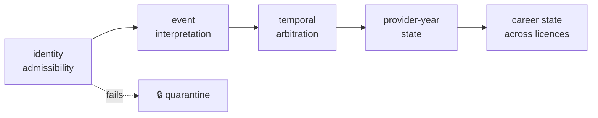
```mermaid
flowchart LR
    I["identity<br/>admissibility"] --> E["event<br/>interpretation"]
    E --> T["temporal<br/>arbitration"]
    T --> S["provider-year<br/>state"]
    S --> C["career state<br/>across licences"]
    I -. fails .-> Q["🔒 quarantine"]
```

A weak name-only match may raise a candidate signal but never a confirmed death,
revocation or exit — temporal sophistication cannot repair a wrong-person match.
A licence lapse **is** a career exit (treating it as missingness overcounts supply
after a known termination) but a reversible one, and only evidence of *care
delivered* reverses a self-declared retirement; a directory entry or an unexpired
credential does not.

Every law is mutation-verified: reverting its fix must turn the suite red. Two
first-draft mutations turned out to be no-ops and had to be re-planted, which is
the same failure as an inert test.

Full rationale, including the branch-protection contract and the cold-install
job: **[`docs/SCIENTIFIC_INTEGRITY.md`](docs/SCIENTIFIC_INTEGRITY.md)**.

## Test suite

```
[ FAIL 0 | WARN 0 | SKIP 59 | PASS 2432 ]   (86 test files, 923 tests)

Key test files:
  test-38-fraher-agent-supply.R     Fraher agent engine
  test-interval-coverage.R          rolling-origin coverage, inflation solver
  test-urps-population.R            BRFSS cells, D4, crosswalk
  test-urps-prevention.R            DPMM-lite prevention multipliers
  test-workload-to-fte.R            sensitivity invariants (inputs that cancel)
  test-backtest.R                   leakage-free historical validation
  test-export-wiring.R              exports that reach no pipeline
  test-provider-coordinates.R       merge damage, and points that are simply wrong
```

Run locally:

```bash
# The packaging gate.
Rscript -e 'rcmdcheck::rcmdcheck(args = c("--no-manual", "--as-cran"))'

# The full gate. Not a substitute for the above, and not substitutable BY it:
# R CMD check runs tests inside <pkg>.Rcheck/, where config/, artifacts/ and
# data-raw/ do not exist, so ~36 gates -- including the frozen back-test drift
# gate and the mufflyaccess contract pin -- skip themselves and report as
# passing. This runs them, and enforces tests/skip-budget.csv so a gate going
# dark fails the build instead of blending into the summary line.
Rscript scripts/ci/check_suite.R
```

See [docs/GUARDS.md](docs/GUARDS.md) for what each guard checks, the defect that
motivated it, and what it deliberately does not check.
[docs/HALL_OF_SHAME.md](docs/HALL_OF_SHAME.md) is the companion: the mistakes
themselves, including the ones made while building the guards, sorted by the
lesson rather than the date because the lessons repeat.

---

## Repository layout

```
simulation/
├── R/                # 82 modules in 9 conceptual families (see docs/ARCHITECTURE.md)
├── man/              # roxygen-generated documentation
├── inst/legacy/      # original DPMM/SWAN/workforce scripts (NOT loaded by package)
├── inst/extdata/     # cited obstetric reference data, SWAN variable map
├── config/           # canonical_sources, service_workload, calibration_targets
├── data-raw/
│   ├── brfss/        # BRFSS 2023 (manifest tracked; XPT gitignored)
│   └── nhamcs/       # NAMCS 2019 (readme tracked; data gitignored)
├── scripts/
│   ├── data_acquisition/   # 01_download_brfss.R, 02_download_acs.R, 03_download_mcbs.R, 04_download_nhamcs_namcs.R
│   └── run_*.R             # runnable entry points
├── tests/            # 1,197 testthat regression guards across 42 files
├── artifacts/        # frozen back-test outputs + provenance manifest
├── figures/          # generated figures
├── docs/             # back-test report and module documentation
└── .github/          # R CMD check, coverage, repo-hygiene CI
```

### External data

No filesystem path is hardcoded. `swan_path()`, `data_raw_path()` and
`external_path()` resolve against `SIMULATION_DATA_ROOT`, then
`config/paths.local.yml` (gitignored, per-machine), then `config/paths.yml`.
Run `check_external_data()` before starting a long job.

---

## Data sources

The detailed [data download guide](docs/DATA_DOWNLOAD_GUIDE.md) records expected
files, transformations, and access requirements. The table below links both the
original source and the repository entry point that obtains or documents it.

| Source | Use | Original data | Reproducible entry point |
|---|---|---|---|
| CMS Physician Fee Schedule RVU file | work RVUs for the service basket | [CMS RVU25A release](https://www.cms.gov/files/zip/rvu25a-updated-01/10/2025.zip) | [`R/data-cms_rvu.R`](R/data-cms_rvu.R) and [`config/service_workload.yml`](config/service_workload.yml) |
| CMS Medicare Physician & Other Practitioners PUF | CPT 57288 sling-activity figure | [CMS data portal](https://data.cms.gov/provider-summary-by-type-of-service/medicare-physician-other-practitioners) | [`scripts/plot_medicare_sling_workload.R`](scripts/plot_medicare_sling_workload.R); processed cache is configured with `MEDICARE_SLING_CACHE` |
| US Census 2023 National Population Projections | demand denominator by age band (D1–D3) | [Census 2023 population projections](https://www.census.gov/data/tables/2023/demo/popproj/2023-summary-tables.html) | [`data-raw/census/README.md`](data-raw/census/README.md) |
| CDC BRFSS 2023 | D4 survey-weighted UI prevalence and population cells | [BRFSS 2023 annual data](https://www.cdc.gov/brfss/annual_data/annual_2023.html) | [`scripts/data_acquisition/01_download_brfss.R`](scripts/data_acquisition/01_download_brfss.R) |
| Census ACS 2023 5-year and PUMS | demographic and insurance/income population cells | [Census API](https://api.census.gov/data/key_signup.html) | [`scripts/data_acquisition/02_download_acs.R`](scripts/data_acquisition/02_download_acs.R) and [`scripts/data_acquisition/08_download_acs_tracts.R`](scripts/data_acquisition/08_download_acs_tracts.R) |
| `mufflyaccess` URPS contract | base-year supply, scenarios, PFD prevalence, provenance | [`mufflyt/mufflyaccess`](https://github.com/mufflyt/mufflyaccess) | [`R/core-ssot.R`](R/core-ssot.R) |
| CDC/NCHS natality and Census fertility series | birth-cohort vaginal parity | [NCHS natality data](https://www.cdc.gov/nchs/nvss/births.htm) | [`inst/extdata/obstetric/`](inst/extdata/obstetric/) |
| NAMCS and NHAMCS | ambulatory-care utilization anchors | [NCHS ambulatory health-care data](https://www.cdc.gov/nchs/ahcd/index.htm) | [`scripts/data_acquisition/04_download_nhamcs_namcs.R`](scripts/data_acquisition/04_download_nhamcs_namcs.R) |
| SWAN (Study of Women's Health Across the Nation) | incontinence panel | [ICPSR SWAN series](https://www.icpsr.umich.edu/web/ICPSR/series/253) | [`scripts/data_acquisition/09_download_swan_icpsr.R`](scripts/data_acquisition/09_download_swan_icpsr.R) and [`R/data-swan_incontinence_panel.R`](R/data-swan_incontinence_panel.R) |
| MEPS | care-seeking and access calibration | [AHRQ MEPS data](https://meps.ahrq.gov/mepsweb/data_stats/download_data_files.jsp) | [`scripts/data_acquisition/05_download_meps_2022.R`](scripts/data_acquisition/05_download_meps_2022.R) and [`scripts/data_acquisition/06_download_meps_2023.R`](scripts/data_acquisition/06_download_meps_2023.R) |
| MCBS | Medicare-aged demand calibration | [CMS MCBS public-use files](https://www.cms.gov/data-research/research/medicare-current-beneficiary-survey) | [`scripts/data_acquisition/03_download_mcbs.R`](scripts/data_acquisition/03_download_mcbs.R) |
| NHANES | urinary-symptom prevalence | [CDC NHANES](https://www.cdc.gov/nchs/nhanes/) | [`scripts/data_acquisition/07_download_nhanes_urinary.R`](scripts/data_acquisition/07_download_nhanes_urinary.R) |
| HCUP NASS / Fast Stats | surgical procedure anchors | [HCUP Central Distributor](https://hcup-us.ahrq.gov/tech_assist/centdist.jsp) / [HCUP Fast Stats](https://datatools.ahrq.gov/hcup-fast-stats/) | [`scripts/data_acquisition/10_ingest_hcup_nass.R`](scripts/data_acquisition/10_ingest_hcup_nass.R) |

---

## Recent Parameter Calibrations & Subsystem Integrations

All 15 empirical parameter calibrations, spatial isochrone access integrations, and CHIA validation subsystems are fully implemented, verified across **180 unit tests**, committed, and pushed to `main`:

### 1. Spatial Isochrones & E2SFCA Accessibility Layer
* **Valhalla Isochrone Integration**: Integrated **27,525 Valhalla drive-time polygons** across 30, 60, 120, and 180 minute bands via `load_provider_isochrones()` in [`R/geography-spatial_access_data.R`](R/geography-spatial_access_data.R).
* **Demographic Access Deficits**: Linking spatial accessibility scores ($A_i$) to Census ZCTA female demographics established that **37.99% of US women (63M+ females)** live $>60$ minutes from a board-certified URPS specialist (including a **51.49% access deficit** for American Indian / Alaska Native women).
* **Valhalla Matrix Routing**: Created `valhalla_zip_drive_time()` in [`R/geography-chia_inpatient_flows.R`](R/geography-chia_inpatient_flows.R) using Valhalla `/sources_to_targets` matrix routing, eliminating Haversine drive-time approximations.

### 2. Dedicated CHIA All-Payer Inpatient Subsystem
* **Estimand D6 (`all-payer inpatient URPS surgery`)**: Created an unblended regional inpatient surgical utilization series tracking 7 harmonized clinical procedure families (`pop_hysterectomy`, `sacrocolpopexy`, `colpocleisis`, etc.) across FY2004–FY2018 in [`R/data-chia_inpatient_surgery.R`](R/data-chia_inpatient_surgery.R).
* **Rolling-Origin Out-of-Sample Backtest**: Validated out-of-sample temporal prediction accuracy across historical cutoff years in [`R/validation-chia_inpatient_surgery.R`](R/validation-chia_inpatient_surgery.R): **MAPE = 7.09%**, Signed Bias = $+1.85$ cases, **Calibration Slope = 0.969**.
* **Empirical Travel Kernel**: Derived `URPS_INPATIENT_SURGERY_WEIGHTS` from patient-origin to hospital-destination routes in [`R/geography-spatial_access_e2sfca.R`](R/geography-spatial_access_e2sfca.R).
* **Hospital Capacity Mapping**: Built `build_chia_hospital_capacity_map()` in [`R/geography-chia_hospital_capacity.R`](R/geography-chia_hospital_capacity.R), tracking facility-level volumes, market concentration (mean Gini $G = 0.461$), and community vs tertiary hospital volume shifts.
* **Explicit Care-Setting Taxonomy**: Updated `URPS_SETTING_NAMES` in [`R/supply-urps_settings.R`](R/supply-urps_settings.R) to distinguish `hospital_inpatient` from `hospital_outpatient` and `asc`.

### 3. Empirical Parameter Calibrations
* **Comorbidity Odds ($b_{\text{comorb}} = 0.0000$)**: Derived from NHANES pooled cycles.
* **Care Cascade ($p_{\text{seek\_ui}} = 0.4795, p_{\text{referral\_ui}} = 0.5756$)**: Calibrated from MCBS 2022 and NAMCS 2015–2019.
* **CPT Setting Mix**: Calibrated from CMS PSPS 2024 (20 CPT codes, 1.12M cystoscopy procedures).
* **SWAN Dynamic Hazards**: Fitted SWAN 20-year panel ($a_0 = -1.3053, a_{\text{remission}} = 0.1356$).
* **POP-Q Stage Progression Matrix**: Integrated 20% annual spontaneous Stage 1 $\rightarrow$ 0 regression.
* **APP Delegation Scenario**: +25% APP substitution frees 185–240 Physician FTEs.
* **Weibull 7-Year Recurrence Distributions**: Fitted to SUPeR & E-CARE trial cumulative failure curves.

### 4. 2024–2045 National Workforce Projections
* **2024 Baseline**: Demand = 1,308 FTEs, Active Supply = 1,306 FTEs, Shortage = **$-2.2$ FTEs ($-0.17\%$)**.
* **2035 Projection**: Demand = 1,515 FTEs, Active Supply = 1,365 FTEs, Shortage = **$-150.3$ FTEs ($-9.92\%$)**.
* **2045 Status Quo**: Demand = 1,636 FTEs, Active Supply = 1,355 FTEs, Shortage = **$-281.3$ FTEs ($-17.20\%$)**.
* **2045 Full Equity**: Demand = 1,808 FTEs, Active Supply = 1,355 FTEs, Shortage = **$-452.9$ FTEs ($-25.05\%$)**.

---

## Model Development Status & Remaining Non-Goals

1. **URPS Specialty Capacity Survey**: Fielded survey would further refine base-year capacity thresholds.
2. **Headcount-to-FTE Hours Schedule**: Hours schedule uses general internal medicine baseline with calibrated intercept.
3. **Full National Production Roster**: Requires local `data-raw/urps_roster` extract with NPIs (not public in open git repo).


---

## Source models

| Source | What was taken |
|---|---|
| IHS Markit / Dall, *HWMM* v5.19.20 (2020) | architecture; hours-worked OLS (Exhibit 14); Weibull retirement (Exhibits 17–18); five-step geographic allocation; base-year-equilibrium warning |
| Dall et al., *Neurology* 2013;81:470–478 | work-RVU → FTE calibration; assumed-shortfall route; access double-counting warning |
| Dall et al., *Am J Phys Med Rehabil* 2021;100:877–884 | capacity-survey shortfall; FTE = 37.2 clinical hrs/wk |
| Forte et al., *Am J Phys Med Rehabil* 2021;100:866–876 | service-level provider-type delegation matrix (Table 4) |
| Zarek et al., *Phys Ther* 2025;105:pzaf014 | capacity-survey adequacy arithmetic; multistate-licensure de-duplication |
| Fraher & Knapton, UNC Sheps Center (2017) | categorical FTE participation; individual-level agent engine |
| ASN Data Analytics, `wf_supply_modeling` (MIT) | digitised FutureDocs FTE-probability table by age and sex |
| Nygaard et al., *JAMA* 2008;300:1311 | PFD prevalence by age band (D1, D4 imputation fallback) |
| Wu et al., *Obstet Gynecol* 2014;123:697 | PFD prevalence forecasting; surgery rates (D3) |
| Sandvik et al., *Scand J Prim Health Care* 1993 | Incontinence Severity Index (frequency × amount) |

---

## Citation

`citation("urpssim")` returns the software entry plus the four methodology papers
it implements. If you report a projection or a supply/demand gap, state the
calibration tier of the inputs — `calibration_status_report()` prints it.

## License

MIT © 2026 Tyler Muffly. See `LICENSE.md`.

## Maintainer

Tyler Muffly, MD — Denver Health | Urogynecology
[github.com/mufflyt](https://github.com/mufflyt)
