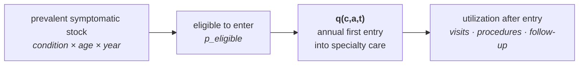
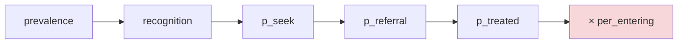

# ADR: the denominator `per_entering` acts on

**Status:** decided — architecture frozen; parameter still unsourced
**Date:** 2026-08-29
**Blocks:** `assert-canonical-science.R` (`ui|pop|ai/conservative/new_consultation/per_entering`)
**Unblocked by:** longitudinal outpatient claims (APCD or equivalent)

---

## The decision

> **`q(c, a, t)` is the annual hazard of first entry into the modeled
> specialty-care pathway among women with prevalent symptomatic disease of
> condition `c`, age `a`, in year `t`, who are eligible to enter.**
>
> It **replaces**, rather than compounds with, any upstream probability
> representing the same process — recognition, care-seeking, referral, or
> treatment initiation. Downstream parameters describe utilization
> **conditional on entry**.

The model is therefore:

and explicitly **not**:

---

## Why this needed deciding before the number could be sourced

It is tempting to describe this as "an unsourced parameter." It is not, or not
only. **The denominator was undefined**, and a hazard has no meaning without
one.

The existing chain multiplies prevalence by recognition, care-seeking,
referral, eligibility and treatment, leaving **2.8%–10.7% of prevalence** in
`treated`. Estimating an incident-entry hazard from the *prevalent eligible
stock* and then multiplying it by `treated` counts recognition, seeking and
referral **twice** — once in the chain, once inside the hazard. The result is
not merely imprecise; it is a different quantity from the one the estimator
measures, and no amount of data collection fixes a denominator mismatch.

Two coherent options existed:

| option | estimand | consequence |
|---|---|---|
| **1. Re-anchor upstream** ✅ | annual entry from the prevalent eligible stock | upstream recognition/seeking/referral terms are absorbed into `q`, not multiplied by it |
| 2. Condition downstream | `P(new consultation this year │ already in treated subset)` | preserves the chain, but the "treated subset" is model-defined and **not directly observable in claims** |

**Option 1 is chosen** because it matches the estimator already designed: *first
observed qualifying FPMRS encounter after washout*, over *an external
disease-prevalence denominator*. That numerator and that denominator together
estimate entry **from the disease population** — not entry conditional on an
artificial model-internal subset. Option 2 would require observing a quantity
the data cannot identify.

The deeper reason is legibility. Under option 2 it is impossible to read off
which terms describe *whether a woman ever reaches care* and which describe
*what happens once she arrives*. Under option 1 that boundary is exactly one
arrow wide.

---

## What this does to the existing parameters

Each arrow must now be classified as before-entry (absorbed into `q`) or
after-entry (retained). **This table is the decision's consequence, not a
completed audit** — the retain/absorb calls are provisional and must be
confirmed against each parameter's actual definition and provenance before
`q` is fitted.

| parameter | before entry? | disposition | confidence |
|---|---|---|---|
| recognition | yes — part of the entry process | absorbed into `q` | likely |
| `p_seek` | yes — part of the entry process | absorbed into `q` | likely |
| `p_referral` | yes, if it means referral *into* specialty care | absorbed into `q`; **or** retained after first non-FPMRS contact if it means something narrower | **needs definition** |
| `p_eligible` | no — a genuine eligibility restriction on who *may* enter | **retained**, applied to the denominator of `q` | likely |
| `p_treated` | ambiguous — reads as post-entry/procedural but is not defined precisely enough to place | **must be redefined before use** | **unresolved** |
| `per_entering` | this *is* the entry hazard | replaced by empirically estimated `q(c,a,t)` | decided |

Two of these are genuinely open. `p_referral` and `p_treated` cannot be
classified from their names, and classifying them wrongly reintroduces exactly
the double-count this ADR exists to remove. **Resolving them is part of the
work, not a formality.**

---

## Estimation rules, once the data exist

These were already specified and are restated so the ADR is self-contained:

- age-specific first-observed entry hazards for **UI, POP and AI** separately
- **24-month primary washout**, with 12- and 36-month sensitivities
- count **unique women**, never visits
- use the **FPMRS roster** to identify specialists where possible, not payer
  taxonomy
- hold the **0.297 utilization ratio strictly as a holdout** — it is validation,
  not a fitting target

---

## What must not happen

`1.00`, `0.25` and `0.297` must not be tuned into a plausible-looking answer.

- **`1.00`** is the current canonical value and is wrong in a knowable
  direction: it treats a prevalence stock as an annual flow, asserting that
  every prevalent treated patient newly enters care each year.
- **`0.25`** appears in `tests/testthat/helper-setup.R::valid_pathway()` and is
  **a fixture, not a candidate value** — chosen only to be a plausible flow so
  that tests of unrelated machinery can run. It carries an explicit warning
  against being read as an estimate.
- **`0.297`** is a holdout. Fitting to it destroys the only independent check
  available.

The readiness gate stays red until `q` is defined *and* sourced. That redness
is the message. See `docs/SCIENTIFIC_INTEGRITY.md` for why a gate that is red
by design is deliberately excluded from the required `scientific-integrity`
check, and why the nightly now reports **BLOCKED / expected** distinctly from
**RED / action required**.

---

## Sequence from here

1. **Done:** freeze the estimand definition above.
2. **Next:** resolve `p_referral` and `p_treated` precisely, and confirm the
   absorb/retain classification for the rest.
3. **Then:** acquire longitudinal outpatient claims.
4. **Then:** estimate `q(c,a,t)` under the rules above.
5. **Last:** compare against the 0.297 holdout — once, without adjusting.

Steps 3–5 are straightforward and well specified. Step 2 is the one that can
still silently reintroduce the double-count.
