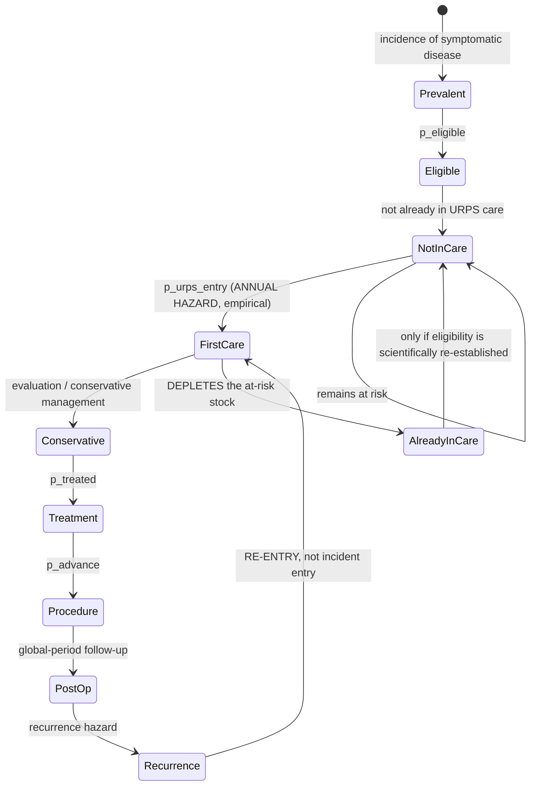

# Pathway state-transition audit — assigning every scalar to an edge

Prerequisite to estimating `per_entering`. **No numerical value is chosen or
fitted here.** The question is only: which transition does each existing scalar
belong to, and are any of them applied out of temporal order?

Prepared 2026-08-17 on `main`.

---

## 1. Why this precedes APCD work

The incident-entry hazard needs a denominator. `docs/INCIDENT_ENTRY_ESTIMAND.md`
§3 established that `treated` is **not** the prevalent eligible stock — it is
2.8–10.7% of prevalence, already carrying care-seeking, referral and treatment.

Estimating a beautiful claims-based hazard against the wrong denominator would
waste the data access. So the decomposition is resolved first.

## 2. What each scalar actually means

Read from `demand_transition_registry()`, not assumed:

| scalar | registry stage | stated meaning | when it happens |
|---|---|---|---|
| `p_ui`,`p_pop`,`p_ai` | — | symptomatic prevalence | **state membership** |
| `recognition` | care_seeking | "symptom recognition (pre-severity)" | before entry |
| `p_seek` | care_seeking | "base care-seeking" | before entry |
| `p_referral` | referral | referral to URPS | before entry |
| `p_eligible` | treatment_eligibility | "treatment-eligibility gate" | **at/after entry** |
| `p_treated` | treatment_preference | "treatment preference **given eligible**" | **at/after entry** |

## 3. THE TEMPORAL DEFECT

`R/demand-lifecourse.R:163` computes, once per model year:

```
treated = prev × recognition × p_seek × p_referral × p_eligible × p_treated
```

and `treated` is then the cohort entering the **conservative** stage, whose
first emitted service is `new_consultation`.

So the model's order is:

```
prevalence → recognition → seek → referral → ELIGIBLE → TREATED → new_consultation → … → procedure
```

The clinical order is:

```
prevalence → recognition → seek → referral → new_consultation → eligible → treated → procedure
```

**`p_eligible` and `p_treated` are applied BEFORE the consultation that
establishes them.** "Treatment preference given eligible" is a decision taken
at or after the visit; it cannot condition entry to the visit. This is a
temporal inversion, not merely a mis-scaled parameter.

`recognition`, `p_seek` and `p_referral` are correctly ordered — all three
genuinely precede a URPS consultation.

### Magnitude

| limb | reach-URPS (correctly ordered) | × p_eligible | × p_treated | = `treated` | inflation removed |
|---|---:|---:|---:|---:|---:|
| ui  | 0.0990 | 1.00 | 0.70 | 0.0693 | **1.43×** |
| pop | 0.1650 | 1.00 | 0.65 | 0.1073 | **1.54×** |
| ai  | 0.0473 | 1.00 | 0.60 | 0.0284 | **1.67×** |

Moving the two misordered factors downstream **raises** the entry cohort by
1.43–1.67×. Note the direction: the current code makes the entry cohort too
*small* by this factor, while `per_entering = 1.00` makes the consultation count
too *large* by the stock/flow error. The two errors act in opposite directions
and partially mask each other — which is why neither was visible in the headline
utilization number alone.

`p_eligible` is 1.00 for all three limbs today (a declared-neutral placeholder),
so it currently changes nothing numerically. It is still misplaced, and would
start doing damage the moment anyone sets it below 1.

## 4. Old versus proposed, side by side

Identical for UI, POP and AI; only the scalars differ.

### Current

```
treated(c)      = N × p_c × recognition_c × p_seek_c × p_referral_c
                        × p_eligible_c × p_treated_c
entering(c)     = treated(c)                              [conservative stage]
new_consult(c)  = entering(c) × per_entering              [per_entering = 1.00]
```

`entering` is a **stock**; `new_consult` is emitted as though it were a flow.

### Proposed

```
eligible_stock(c) = N × p_c × recognition_c                 STOCK
new_consult(c)    = eligible_stock(c) × q(c, a, t)          FLOW   ← the hazard
conservative(c)   = new_consult(c)
treatment(c)      = conservative(c) × p_eligible_c × p_treated_c
procedure(c)      = treatment(c) × p_advance(...)
recurrence(c)     = procedure(c) × recurrence hazard
```

with

> **q(c,a,t)** = among women in the eligible prevalent stock who are **not
> already in the pathway**, the fraction newly entering URPS care this year.

### Where each existing parameter goes

| parameter | today | proposed | note |
|---|---|---|---|
| `p_ui`/`p_pop`/`p_ai` | stock | **stock** | unchanged |
| `recognition` | pre-entry multiplier | **stock membership** | defines *eligible* stock — see §5 |
| `p_seek` | pre-entry multiplier | **absorbed into `q`** | see §5 — this is the open question |
| `p_referral` | pre-entry multiplier | **absorbed into `q`** | see §5 |
| `p_eligible` | pre-entry multiplier | **edge: consultation → treatment** | moved downstream |
| `p_treated` | pre-entry multiplier | **edge: consultation → treatment** | moved downstream |
| `per_entering` (conservative) | 1.00 multiplier on a stock | **replaced by `q`, a hazard** | the blocker |
| `per_entering` (recurrence) | 1.00 | **unchanged — correct** | its input is already a flow |
| `p_advance` | edge | **edge** | unchanged |

## 5. THE OPEN QUESTION — does `q` replace `p_seek × p_referral`, or multiply them?

`q` is estimated from claims as *first observed URPS care ÷ prevalent eligible
stock*. That observed numerator **already reflects** whatever seeking and
referral behaviour occurred. So:

- If `q` is estimated against a denominator of `N × p_c × recognition`, then
  `q` **subsumes** `p_seek` and `p_referral`, and retaining them as separate
  multipliers would double-count.
- If `q` is estimated against `N × p_c × recognition × p_seek × p_referral`,
  then `q` is a conditional entry rate among the already-referred — a quantity
  claims probably cannot identify, because referral status is not reliably
  observable for women who never present.

**Recommendation: the first.** It matches what claims can actually measure, and
it collapses three unsourced placeholders into one estimable quantity. But it
retires `p_seek` and `p_referral` as free parameters, which is a substantive
modelling decision and needs to be made explicitly rather than as a side effect.

Whether `recognition` belongs in the stock or inside `q` is the same question
one level up. Argument for keeping it in the stock: an unrecognised symptom is
arguably not an *eligible* prevalent case. Argument for absorbing it: claims
cannot see recognition either, so it is no more identifiable than seeking.

**This is the decision that unblocks the APCD work, and it is not mine to make
unilaterally.**

## 6. Why the prevalent-stock formulation is preferred

Conditioning `q` on the `treated` subset would define the denominator using
information generated **after** the consultation being modelled — treatment
preference is observed downstream of entry. That is a look-ahead selection: the
denominator becomes partly a function of the outcome, and censoring and
incomplete follow-up stop being interpretable.

A `treated`-subset denominator is admissible only if all of the following hold,
and today they do not:

| requirement | status |
|---|---|
| `treated` definable at or before time zero | ✗ — `p_treated` is a downstream preference |
| identical restriction reproducible in claims without future information | ✗ |
| `seek × referral × treated` free of the transition being estimated | ✗ — see §5 |
| women never reaching treatment intentionally outside the denominator | unclear |
| parameter stable as treatment patterns change | ✗ — it would drift with practice |

## 7. DECISION (2026-08-17): one estimable entry hazard

Ruled, and now canonical:

> Estimate **one** annual hazard from the eligible prevalent stock to first
> observed URPS care. It subsumes recognition, seeking, referral, access and
> arrival, insofar as those determine whether a prevalent woman reaches the
> claims-observable URPS state.

**Identifiability is the reason.** Claims identify the PRODUCT

```
p_recognition x p_seek|recognized x p_referral|seek x p_arrival|referral
```

not its components. Multiplying an empirical hazard by `p_seek` and
`p_referral` afterwards would double-count losses already inside the numerator.

| parameter | disposition |
|---|---|
| `p_eligible` | **keep**, moved UPSTREAM to define the exposed stock |
| `recognition` | **retire** as an independent multiplier |
| `p_seek` | **retire** as an independent multiplier |
| `p_referral` | **retire** as an independent multiplier |
| `per_entering` (conservative) | **replace** with an empirical annual entry hazard |
| treatment / procedure | **keep**, downstream of first care |
| recurrence | **keep**, a separate flow process |

`p_eligible = 1.00` being numerically inert today is not a reason to leave it
misplaced. The topology is fixed now so that setting it to 0.7 later changes the
intended quantity.

**Renamed.** `per_entering` hid the stock/flow ambiguity. The canonical name is
**`p_urps_entry`**:

> Annual probability that an eligible prevalent woman **not already in the
> modelled URPS-care state** has her first qualifying observed URPS care episode
> during the year.

Previously treated women re-enter through **recurrence**, never through this
hazard.

**Recognition is retired as a parameter, not as a concept.** The causal
decomposition stays in the documentation with its components marked
individually unidentified, so the model does not pretend to know quantities it
cannot identify while the causal story survives. Any component becomes
identifiable only if an external source (survey, EHR, referral records)
measures it directly.

## 8. THE DEPLETION DEFECT — the architecture has no stock to deplete

Checked before proposing any implementation, and the answer is worse than "the
depletion rule is missing".

`lifecourse_demand_trajectory()` is:

```r
runs <- purrr::map(years, function(y) {
  pa <- dplyr::filter(pop_by_age_year, .data$year == y)
  simulate_lifecourse_demand(pa, year = y, scenario = scenario, n = n, seed = seed, ...)
})
```

Every year is an **independent** call from that year's population table. Grep
for cross-year state (`previous`, `prior_year`, `carry`, `already_in_care`,
`year - 1`) returns **nothing**, and the SAME `seed` is passed to every year, so
the synthetic cohort is regenerated identically each time.

**The demand model is a repeated independent cross-section, not a longitudinal
cohort.** Consequences:

1. A woman who entered care in 2026 is fully back in the at-risk stock in 2027
   with an unchanged chance of being "new" again.
2. There is no state in which "already in care" could be recorded, so the
   required transition

   ```
   S(t+1) = S(t) + new disease - first entries - other exits + eligible returns
   ```

   has nowhere to live.
3. **Therefore `p_urps_entry` cannot simply be substituted for `per_entering`.**
   Dropping a correct hazard into a stateless cross-section reproduces the same
   defect at a smaller magnitude: each year still regenerates entrants from the
   undepleted stock, just a smaller fraction of it.

This is the same class of error one level deeper. The guard caught "prevalent
patients become new every year"; this is "there is no mechanism by which they
could stop being new".

### What this implies for sequencing

The APCD estimator is still worth building — `p_urps_entry` is well defined and
estimable regardless. But **inserting it requires a persistent care-state stock
first**, which is an architectural change to the demand engine, not a parameter
swap. Options, none costed here:

- carry an `already_in_care` compartment across years (a genuine stock model);
- or model entry as an age-specific first-passage/hazard over the life course,
  where "already entered" is absorbing until recurrence returns her.

The supply side already runs a longitudinal microsimulation
(`simulate_provider_career_once`), so the machinery pattern exists in the
repository.

## 9. Canonical state-transition diagram

Identical structure for UI, POP and AI; only the scalars differ.



The two edges that do not exist in the code today are
`FirstCare --> AlreadyInCare` and its complement `NotInCare --> NotInCare`.
Without them the model has no at-risk stock to deplete (§8).

`Recurrence --> FirstCare` is deliberately a **separate** edge: previously
treated women re-enter through recurrence and must never be counted by
`p_urps_entry`.

## 10. Old versus new, final form

```
CURRENT  (repeated cross-section; no state)

  treated(c,t)     = N(t) x p_c x recognition_c x p_seek_c x p_referral_c
                            x p_eligible_c x p_treated_c
  entering(c,t)    = treated(c,t)
  new_consult(c,t) = entering(c,t) x per_entering          [= 1.00]

  -- p_eligible and p_treated applied BEFORE the consultation they follow
  -- entering is a STOCK emitted as a FLOW
  -- no depletion: every prevalent woman is eligible to be "new" every year


PROPOSED  (stock/flow with a persistent care state)

  E(c,a,t)         = N(a,t) x p_c(a,t) x p_eligible_c            ELIGIBLE STOCK
  S(c,a,t)         = E(c,a,t) - AlreadyInCare(c,a,t)             AT RISK
  N_entry(c,a,t)   ~ Binomial( S(c,a,t), p_urps_entry(c,a,t) )   FLOW

  conservative     = N_entry
  treatment        = conservative x p_treated_c
  procedure        = treatment x p_advance
  recurrence       = procedure x recurrence_hazard               separate flow

  AlreadyInCare(c,a,t+1) = AlreadyInCare(c,a,t) + N_entry(c,a,t)
                           - exits - eligible returns
```

`recognition`, `p_seek`, `p_referral` no longer appear: they are latent
components of `p_urps_entry`, identified only as their product.

## 11. What this does NOT resolve

- No value for `q` is proposed. The estimator stays as pre-registered in
  `docs/INCIDENT_ENTRY_ESTIMAND.md`.
- Whether `recognition` sits in the stock or inside `q` (§5).
- Whether `p_seek`/`p_referral` are retired or retained (§5).
- The **0.12 / 0.40** recurrence limb, which the same longitudinal cohort should
  address once entry is settled.

The 1.43–1.67× inflation removal in §3 must **not** be applied on its own as a
"fix". It is one of two errors pointing in opposite directions; correcting one
without the other would move the headline number for the wrong reason and could
easily look like an improvement.
