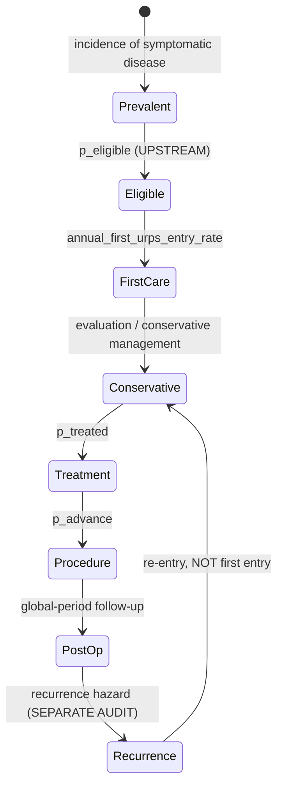

# Pathway state-transition audit — assigning every scalar to an edge

Prerequisite to estimating `per_entering`. **No numerical value is chosen or
fitted here.** The question is only: which transition does each existing scalar
belong to, and are any of them applied out of temporal order?

Prepared 2026-08-17 on `main`.

---

## 1. Why this precedes APCD work

The incident-entry hazard needs a denominator. `docs/INCIDENT_ENTRY_ESTIMAND.md`
§3 established that `treated` is **not** the prevalent eligible stock — it is
2.8–10.7% of prevalence, already carrying care-seeking, referral and treatment.

Estimating a beautiful claims-based hazard against the wrong denominator would
waste the data access. So the decomposition is resolved first.

## 2. What each scalar actually means

Read from `demand_transition_registry()`, not assumed:

| scalar | registry stage | stated meaning | when it happens |
|---|---|---|---|
| `p_ui`,`p_pop`,`p_ai` | — | symptomatic prevalence | **state membership** |
| `recognition` | care_seeking | "symptom recognition (pre-severity)" | before entry |
| `p_seek` | care_seeking | "base care-seeking" | before entry |
| `p_referral` | referral | referral to URPS | before entry |
| `p_eligible` | treatment_eligibility | "treatment-eligibility gate" | **at/after entry** |
| `p_treated` | treatment_preference | "treatment preference **given eligible**" | **at/after entry** |

## 3. THE TEMPORAL DEFECT

`R/demand-lifecourse.R:163` computes, once per model year:

```
treated = prev × recognition × p_seek × p_referral × p_eligible × p_treated
```

and `treated` is then the cohort entering the **conservative** stage, whose
first emitted service is `new_consultation`.

So the model's order is:

```
prevalence → recognition → seek → referral → ELIGIBLE → TREATED → new_consultation → … → procedure
```

The clinical order is:

```
prevalence → recognition → seek → referral → new_consultation → eligible → treated → procedure
```

**`p_eligible` and `p_treated` are applied BEFORE the consultation that
establishes them.** "Treatment preference given eligible" is a decision taken
at or after the visit; it cannot condition entry to the visit. This is a
temporal inversion, not merely a mis-scaled parameter.

`recognition`, `p_seek` and `p_referral` are correctly ordered — all three
genuinely precede a URPS consultation.

### Magnitude

| limb | reach-URPS (correctly ordered) | × p_eligible | × p_treated | = `treated` | inflation removed |
|---|---:|---:|---:|---:|---:|
| ui  | 0.0990 | 1.00 | 0.70 | 0.0693 | **1.43×** |
| pop | 0.1650 | 1.00 | 0.65 | 0.1073 | **1.54×** |
| ai  | 0.0473 | 1.00 | 0.60 | 0.0284 | **1.67×** |

Moving the two misordered factors downstream **raises** the entry cohort by
1.43–1.67×. Note the direction: the current code makes the entry cohort too
*small* by this factor, while `per_entering = 1.00` makes the consultation count
too *large* by the stock/flow error. The two errors act in opposite directions
and partially mask each other — which is why neither was visible in the headline
utilization number alone.

`p_eligible` is 1.00 for all three limbs today (a declared-neutral placeholder),
so it currently changes nothing numerically. It is still misplaced, and would
start doing damage the moment anyone sets it below 1.

## 4. Old versus proposed, side by side

Identical for UI, POP and AI; only the scalars differ.

### Current

```
treated(c)      = N × p_c × recognition_c × p_seek_c × p_referral_c
                        × p_eligible_c × p_treated_c
entering(c)     = treated(c)                              [conservative stage]
new_consult(c)  = entering(c) × per_entering              [per_entering = 1.00]
```

`entering` is a **stock**; `new_consult` is emitted as though it were a flow.

### Proposed

```
eligible_stock(c) = N × p_c × recognition_c                 STOCK
new_consult(c)    = eligible_stock(c) × q(c, a, t)          FLOW   ← the hazard
conservative(c)   = new_consult(c)
treatment(c)      = conservative(c) × p_eligible_c × p_treated_c
procedure(c)      = treatment(c) × p_advance(...)
recurrence(c)     = procedure(c) × recurrence hazard
```

with

> **q(c,a,t)** = among women in the eligible prevalent stock who are **not
> already in the pathway**, the fraction newly entering URPS care this year.

### Where each existing parameter goes

| parameter | today | proposed | note |
|---|---|---|---|
| `p_ui`/`p_pop`/`p_ai` | stock | **stock** | unchanged |
| `recognition` | pre-entry multiplier | **stock membership** | defines *eligible* stock — see §5 |
| `p_seek` | pre-entry multiplier | **absorbed into `q`** | see §5 — this is the open question |
| `p_referral` | pre-entry multiplier | **absorbed into `q`** | see §5 |
| `p_eligible` | pre-entry multiplier | **edge: consultation → treatment** | moved downstream |
| `p_treated` | pre-entry multiplier | **edge: consultation → treatment** | moved downstream |
| `per_entering` (conservative) | 1.00 multiplier on a stock | **replaced by `q`, a hazard** | the blocker |
| `per_entering` (recurrence) | 1.00 | **unchanged — correct** | its input is already a flow |
| `p_advance` | edge | **edge** | unchanged |

## 5. THE OPEN QUESTION — does `q` replace `p_seek × p_referral`, or multiply them?

`q` is estimated from claims as *first observed URPS care ÷ prevalent eligible
stock*. That observed numerator **already reflects** whatever seeking and
referral behaviour occurred. So:

- If `q` is estimated against a denominator of `N × p_c × recognition`, then
  `q` **subsumes** `p_seek` and `p_referral`, and retaining them as separate
  multipliers would double-count.
- If `q` is estimated against `N × p_c × recognition × p_seek × p_referral`,
  then `q` is a conditional entry rate among the already-referred — a quantity
  claims probably cannot identify, because referral status is not reliably
  observable for women who never present.

**Recommendation: the first.** It matches what claims can actually measure, and
it collapses three unsourced placeholders into one estimable quantity. But it
retires `p_seek` and `p_referral` as free parameters, which is a substantive
modelling decision and needs to be made explicitly rather than as a side effect.

Whether `recognition` belongs in the stock or inside `q` is the same question
one level up. Argument for keeping it in the stock: an unrecognised symptom is
arguably not an *eligible* prevalent case. Argument for absorbing it: claims
cannot see recognition either, so it is no more identifiable than seeking.

**This is the decision that unblocks the APCD work, and it is not mine to make
unilaterally.**

## 6. Why the prevalent-stock formulation is preferred

Conditioning `q` on the `treated` subset would define the denominator using
information generated **after** the consultation being modelled — treatment
preference is observed downstream of entry. That is a look-ahead selection: the
denominator becomes partly a function of the outcome, and censoring and
incomplete follow-up stop being interpretable.

A `treated`-subset denominator is admissible only if all of the following hold,
and today they do not:

| requirement | status |
|---|---|
| `treated` definable at or before time zero | ✗ — `p_treated` is a downstream preference |
| identical restriction reproducible in claims without future information | ✗ |
| `seek × referral × treated` free of the transition being estimated | ✗ — see §5 |
| women never reaching treatment intentionally outside the denominator | unclear |
| parameter stable as treatment patterns change | ✗ — it would drift with practice |

## 7. DECISION (2026-08-17): one estimable entry rate

Ruled, and now canonical:

> Estimate **one** annual RATE from the eligible prevalent stock to first
> observed URPS care. It subsumes recognition, seeking, referral, access and
> arrival, insofar as those determine whether a prevalent woman reaches the
> claims-observable URPS state.

**Identifiability is the reason.** Claims identify the PRODUCT

```
p_recognition x p_seek|recognized x p_referral|seek x p_arrival|referral
```

not its components. Multiplying an empirical hazard by `p_seek` and
`p_referral` afterwards would double-count losses already inside the numerator.

| parameter | disposition |
|---|---|
| `p_eligible` | **keep**, moved UPSTREAM to define the exposed stock |
| `recognition` | **retire** as an independent multiplier |
| `p_seek` | **retire** as an independent multiplier |
| `p_referral` | **retire** as an independent multiplier |
| `per_entering` (conservative) | **replace** with the empirical annual first-entry RATE |
| treatment / procedure | **keep**, downstream of first care |
| recurrence | **keep**, a separate flow process |

`p_eligible = 1.00` being numerically inert today is not a reason to leave it
misplaced. The topology is fixed now so that setting it to 0.7 later changes the
intended quantity.

**Renamed.** `per_entering` hid the stock/flow ambiguity. The canonical name is
**`annual_first_urps_entry_rate`** -- NOT a conditional hazard, see §8:

> Among ALL eligible prevalent women in a year -- regardless of previous care
> history -- the fraction having their first qualifying observed URPS care
> episode during that year.

Previously treated women re-enter through **recurrence**, never through this
hazard.

**Recognition is retired as a parameter, not as a concept.** The causal
decomposition stays in the documentation with its components marked
individually unidentified, so the model does not pretend to know quantities it
cannot identify while the causal story survives. Any component becomes
identifiable only if an external source (survey, EHR, referral records)
measures it directly.

## 8. TWO ESTIMANDS — and only one needs persistent state

**A correction to an earlier draft of this section.** It concluded that the
repeated-cross-section engine made first-entry modelling invalid and that a
longitudinal demand engine was required. That was an overcorrection: *"not
longitudinal"* and *"invalid for annual aggregate first-entry demand"* are
different claims, and conflating them would have forced an expensive rewrite
that the evidence does not demand.

### The architectural fact (unchanged)

`lifecourse_demand_trajectory()` runs `purrr::map(years, ...)` — one
**independent** `simulate_lifecourse_demand()` per year, with the SAME `seed`
each time. A grep for cross-year state (`previous`, `prior_year`, `carry`,
`already_in_care`, `year - 1`) returns nothing. The engine is a repeated
independent cross-section and carries no individual history.

That is true. What it *implies* depends entirely on which estimand is adopted.

### A. Population-level first-entry rate — NO persistent state required

```
q_pop(c,a,t) =  first observed qualifying URPS entrants in year t
                -------------------------------------------------
                ALL eligible prevalent women in year t
```

Women who entered care in earlier years **remain in the denominator** and
**cannot appear in the numerator**. Depletion is therefore already embedded,
empirically, in the measured rate. Applied to an annual cross-sectional stock:

```
first_entrants(c,a,t) = eligible_prevalent_stock(c,a,t) x q_pop(c,a,t)
```

is valid for aggregate annual first-entry demand **without individual care
histories**.

This is also precisely what the chosen evidence identifies: an APCD numerator
divided by an external prevalence denominator.

### B. Conditional first-entry hazard — persistent state REQUIRED

```
h_entry(c,a,t) =  first observed qualifying URPS entrants in year t
                  --------------------------------------------------
                  eligible prevalent women who have NEVER entered before
```

This needs a never-entered risk set that depletes over time. **APCD numerator ÷
external total prevalence does not estimate it** — the never-entered denominator
is not directly observable and would itself have to be reconstructed.

### DECISION: adopt A as the canonical baseline

Because it is directly identifiable from the evidence already chosen; it
subsumes recognition, seeking, referral, access, arrival **and prior-care
depletion** into one observable aggregate; it invents no unobservable
never-treated denominator; and it lets the demand side stay cross-sectional for
this quantity.

Consequences, each load-bearing:

1. **It is NOT a conditional hazard and must not be named like one.** Canonical
   name: **`annual_first_urps_entry_rate`**, denominator stated explicitly as
   *all eligible prevalent women regardless of previous care history*.
2. **DO NOT add a depletion correction on top of it.** Historical depletion is
   already inside the measured rate; subtracting prior entrants again would
   double-count it. This is the specific trap created by the earlier draft's
   conclusion.
3. `recognition`, `p_seek`, `p_referral` stay retired (§7).
4. `p_eligible` stays upstream, defining the exposed stock.

### The forecast assumption this carries

`q_pop` measured on historical years embeds the then-current mixture of
never-treated and previously-treated women, recognition, referral, access,
insurance and specialist availability. Holding it fixed over a 20-year forecast
assumes those processes are stable — **especially questionable in a model whose
whole purpose is to vary specialist supply.**

That is an explicit, estimable baseline assumption, and far preferable to
pretending `recognition x p_seek x p_referral` are separately known. If evidence
later supports it, `q_pop` can be modelled as a function of access.

### What the cross-sectional engine CANNOT support

Valid under A for annual aggregate first-entry counts. **Not** valid for any
individual longitudinal claim:

- cumulative probability of ever entering care;
- time since treatment, or time-to-event of any kind;
- individual recurrence histories;
- anything conditioned on a person's own past.

Those require persistent state, and no amount of parameter work substitutes.

### RECURRENCE IS THE CASE THAT GENUINELY DIFFERS — audit separately

The engine computes recurrence entrants as **this year's** primary operations x
the annual hazard: 350 x 0.12 = 42 per 1,000 treated. Recurrences actually arise
from the **accumulated stock of everyone previously operated**, so the model
exposes a single cohort-year. Already pinned in
`test-pop-cascade-gate.R` and `docs/POP_RECURRENCE_ESTIMAND_AUDIT.md`.

Unlike first entry, no population-level rate rescues this automatically: the
denominator *is* explicitly a historical cohort. It needs either

1. persistent prior-treatment state, or
2. an externally estimated population-level recurrence rate whose denominator is
   itself measurable without simulated history.

**The first-entry finding must not force the recurrence limb into an
architecture chosen for a different quantity, and vice versa.** They are audited
separately.

## 9. Canonical state-transition diagram (estimand A)

Identical structure for UI, POP and AI; only the scalars differ.



**There is deliberately no `AlreadyInCare` compartment.** Under estimand A the
denominator is *all* eligible prevalent women, so previously-entered women stay
in `Eligible` and are prevented from re-appearing in the numerator by the
empirical rate itself, not by a modelled transition. Adding a depletion edge
here would double-count history already inside the measured rate.

`Recurrence --> Conservative` is drawn dashed in intent: it is a separate flow
process whose own denominator is a historical cohort, and it is audited apart
from first entry (§8).

## 10. Old versus new, final form

```
CURRENT  (repeated cross-section)

  treated(c,t)     = N(t) x p_c x recognition_c x p_seek_c x p_referral_c
                            x p_eligible_c x p_treated_c
  entering(c,t)    = treated(c,t)
  new_consult(c,t) = entering(c,t) x per_entering          [= 1.00]

  -- p_eligible and p_treated applied BEFORE the consultation they follow
  -- a prevalence STOCK emitted as a FLOW
  -- recognition x p_seek x p_referral not separately identifiable


PROPOSED  (estimand A -- still cross-sectional, no persistent state)

  E(c,a,t)        = N(a,t) x p_c(a,t) x p_eligible_c        ELIGIBLE STOCK
  entrants(c,a,t) = E(c,a,t) x annual_first_urps_entry_rate(c,a,t)

      denominator: ALL eligible prevalent women, regardless of prior care.
      Historical depletion is EMBEDDED in the empirical rate.
      DO NOT subtract prior entrants -- that double-counts it.

  conservative    = entrants
  treatment       = conservative x p_treated_c
  procedure       = treatment x p_advance
  recurrence      = SEPARATE audit; denominator is a historical cohort,
                    currently one cohort-year (350 x 0.12 = 42 per 1,000)
```

`recognition`, `p_seek`, `p_referral` no longer appear: they are latent
components of the measured entry rate, identified only as their product.

## 11. WHAT THE DEMAND MODEL PRODUCES — need, or realized utilization?

The two interpretations cannot be mixed, and which one applies decides whether
`annual_first_urps_entry_rate` may stay fixed while simulated supply changes.

**Architecturally the model produces LATENT NEED.** Demand runs one-directional
into `convert_workload_to_fte()`; a grep for supply terms in the demand modules
finds only comments about handing volumes onward. No supply variable feeds back
into care entry. The gap analysis then contrasts required FTE with available
FTE, which only makes sense if the requirement is independent of the supply.

Under that reading, holding the entry rate fixed as supply falls is **correct**:
need does not shrink because fewer specialists exist.

### The tension this creates, and it is not small

`annual_first_urps_entry_rate` is measured from **observed first entries in
claims** — which is realized utilization, not need. Using it as a need parameter
assumes:

> the observed entry rate already equals the need rate — i.e. current access is
> not binding.

If URPS supply is **already** constrained today, observed entries **understate**
need, and a model built on them understates the gap. The direction of that bias
is knowable even if the magnitude is not: it makes the workforce shortfall look
smaller than it is, which is the conservative direction for a shortage claim but
the wrong direction for planning.

### Consequences to carry into estimation

1. Label every reported quantity. `annual_first_urps_entry_rate` is an
   **observed-utilization** measurement being **used as** a need parameter.
   That substitution is an assumption, not a definition.
2. Do **not** add supply-dependence to the entry rate without also changing the
   model's declared output from need to realized utilization. A hybrid — a
   need model whose entry rate responds to supply — is not interpretable.
3. The pre-registered sensitivity matrix should include a stratum on **baseline
   access adequacy**: if entry rates in high-supply regions materially exceed
   low-supply regions after age standardisation, current access IS binding and
   the need/utilization substitution is measurably wrong. The MA APCD carries
   geography, so this is testable rather than merely arguable.
4. `access_gain` already modifies care-seeking for high-barrier individuals, but
   it is a scenario lever, not supply-driven feedback. It must not be mistaken
   for the mechanism described above.

## 12. What this does NOT resolve

- No value for `q` is proposed. The estimator stays as pre-registered in
  `docs/INCIDENT_ENTRY_ESTIMAND.md`.
- Whether `recognition` sits in the stock or inside `q` (§5).
- Whether `p_seek`/`p_referral` are retired or retained (§5).
- The **0.12 / 0.40** recurrence limb, which the same longitudinal cohort should
  address once entry is settled.

The 1.43–1.67× inflation removal in §3 must **not** be applied on its own as a
"fix". It is one of two errors pointing in opposite directions; correcting one
without the other would move the headline number for the wrong reason and could
easily look like an improvement.
