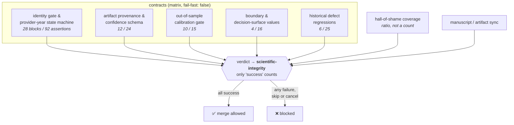
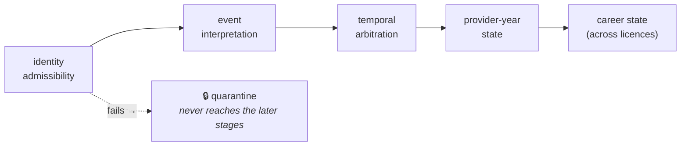

# Scientific integrity: what a green build is allowed to mean

This is the appendix for the contracts under `.github/workflows/scientific-integrity.yaml`
and the retirement modules in `R/supply-retirement_*.R`. It records **why** each
gate exists, because every one of them was written for a defect that had already
shipped, and a gate whose motivating failure is forgotten is the next thing to be
deleted for being noisy.

The standard being aimed at is stronger than "all tests pass":

> No plausible code change can alter who exists, when they exist, which data
> created that decision, or the published result, without CI noticing.

---

## 1. The aggregator

Branch protection can require exactly one check. Requiring `scientific-integrity`
makes every contract below blocking without maintaining a second list in the
GitHub UI, where it drifts silently from the workflows it names.



**Why separate jobs.** A single job reports one result, so a change that breaks
the identity gate and a change that breaks artifact provenance become
indistinguishable in the checks list. The matrix names the broken law in the UI
before anyone opens a log, and `fail-fast: false` stops one failure hiding the
others.

**Why `verdict` re-checks results instead of trusting `needs`.** A skipped or
cancelled job does not fail its dependents by default, and a skipped required
check can be reported as neutral. Only `success` counts here.

**Why a script, not `testthat::test_file()`.** Exiting 0 is satisfied by a file
that discovered *zero* tests and by one that *skipped every test*.
`.github/scripts/run-scientific-contract.R` asserts positively that blocks were
discovered, that assertions actually passed, and that a named contract file still
exists — so deleting a test is not a way to stop enforcing a law.

### Deliberately **not** required

| gate | why not |
|---|---|
| canonical readiness audit | **Red by design** until an unresolved parameter is sourced. A permanently-red required check trains everyone to merge past red, which is worse than having none. |
| `cold-install` | Reaches the network and third-party remotes; can fail for reasons a PR did not cause. Loud and scheduled instead. |
| platform matrix, coverage, frozen restore, full suite | Slow. They live in the nightly. |

### Branch protection is part of the contract

A required check an administrator can push past is a suggestion.

```
required_status_checks.contexts = ["scientific-integrity"]
enforce_admins                  = true
allow_force_pushes              = false
allow_deletions                 = false
```

`enforce_admins = true` is the load-bearing line. **Break-glass** is deliberate
and auditable rather than standing: disable `enforce_admins`, push while saying
in the commit message why, re-enable in the same session. All three API calls
land in the audit log.

---

## 2. The retirement contract

The defect replaced was `cumsum(any_exit) > 0`, which makes exit **absorbing by
construction**. Two wrong things follow, and both produce plausible
provider-years rather than errors: once any exit signal appears every later year
inherits `EXITED` even after the pipeline separately observes a return; and
activity in one year silently fills the years around it, because a cumulative
flag has no way to say *no evidence this year*.

### Order is the contract



A weak name-only match may raise a candidate signal; it may **never** produce
`DECEASED`, `REVOKED`, `SURRENDERED` or a confirmed exit. Temporal sophistication
cannot repair a wrong-person match — arbitrating dates between two different
physicians is a category error, not a hard problem. Death carries a stricter
identity threshold than other exits because it is irreversible downstream.

### A licence lapse is a career exit

An earlier draft classified `expired`/`lapsed`/`inactive`/`not renewed` as
*nonterminal*. That was wrong for a workforce study **in a specific direction**:
treating a lapse as missingness leaves the provider-year standing, so supply is
systematically **overcounted** after a known licence termination, inflating the
denominator of every downstream access measure. That is bias, not noise.

Exit is not the same as absorbing. `retirement_exit_taxonomy()`:

| exit class | statuses | reversal |
|---|---|---|
| `licensure_lapse` | expired, lapsed, inactive, not renewed | documented reinstatement |
| `licensure_suspension` | suspended | documented reinstatement |
| `licensure_revocation` | revoked, surrendered | documented reinstatement |
| `self_declared_retirement` | retired | clinical activity alone |
| `terminal_death` | deceased | **never — absorbing** |

Billing activity is evidence of billing, not of a licence, so activity alone must
not clear a lapse — otherwise the exit is cosmetic and the overcount returns
through the back door.

### What may reverse a retirement

`retired` is the one exit clinical activity can reverse without a licence action,
which makes the definition of "activity" load-bearing. The line is **care
delivered in that year**, not **continuing to exist in a database**:

| tier | sources | reverses? |
|---|---|---|
| `clinical_contemporaneous` | medicare/medicaid/commercial claims, encounter record, procedure log, hospital privileging | **yes** |
| `administrative_registry` | NPPES record, provider directory, roster membership, affiliation listing | never |
| `credential_status` | board certification, unexpired licence, DEA registration | never |

An NPPES record persists after practice stops and deactivates late; a credential
is permission to work, not evidence of working. Unrecognised or undeclared
sources **fail closed** — otherwise every new data feed silently gains the power
to un-retire people the day it is wired in.

Registry activity after retirement is **not** a `CONFLICT`. It is expected;
routing it there would bury post-death activity and unlicensed practice under
routine noise.

### Licence level vs career level

A physician licensed in Colorado and Wyoming whose Wyoming licence expires has
not left the workforce — they have left Wyoming's. A career exit requires **no
qualifying active licence remaining**. The error is not uniform: multi-state
physicians hold the most licences and so have the most opportunities for one to
lapse, concentrating overstated attrition in the group least likely to have
actually retired.

Precedence is fail-closed against overstating **supply**, so an unobserved
licence yields `UNKNOWN` rather than `EXITED` — that under-reports exits rather
than over-reporting workforce.

---

## 3. Mutation testing, and two mutations that were no-ops

A passing test proves nothing. Every law above was verified by reverting its fix
and confirming the suite goes red.

| mutant | failures |
|---|---|
| lapse family treated as non-exit | 18 |
| reinstatement requirement ignored | 16 |
| state machine drops the source threshold | 17 |
| unassessed activity source treated as qualifying | 17 |
| activity alone clears a lapse | 10 |
| exit absorbing / ignore reactivation | 3 |
| ACTIVE carries into a gap year | 3 |
| death reversible · identity gate demoted · death bar weakened | 1 each |

**Two first-draft mutations survived and were not real defects.** One reordered
two `case_when` arms that are mutually exclusive by construction; the other was
masked because the fixture's reactivation row also carried positive activity, so
`ACTIVE` came from the activity branch and the test passed for the wrong reason.
Both had to be re-planted before they tested anything. *A mutation that cannot
fail measures nothing, exactly like the test it is checking.*

---

## 4. Hall-of-Shame coverage is a ratio

`docs/HALL_OF_SHAME.md` is a machine-readable registry only if something
machine-reads it; otherwise it is a memoir. The invariant is

```
historical failures covered / historical failures total
```

not a count of tests, which can be satisfied by adding unrelated coverage.
Linking is by tag inside the test description — `@hall_of_shame 24` — so nothing
is maintained in parallel, a second hand-maintained list being entry 18's own
defect. A tag naming an entry that no longer exists is an error too.

**Waivers are debt, not exemption**, and are reported separately so the list can
never be read as coverage. Current state: **12 enforced, 22 waived, 0 open** of
34. The waivers divide into `process` failures with no code path to assert and
`external` laws whose data lives outside this package.

---

## 5. Cold install, and why it is permanent

`mysterycall` entered `Suggests` without a matching `Remotes:` entry, making the
dependency graph unsolvable. **Nothing noticed for months**, because
`r-lib/setup-r-dependencies` restores a built library and a warm cache never
re-resolves — `scientific-bva` was still reporting `Cache hit … ~161 MB` on the
exact commit where a cold solve failed before a single test ran.

It surfaced only because a new workflow had no cache to restore. Every workflow
in the repository was one cache eviction away from being unable to install the
package at all.

`cold-install.yaml` therefore solves the graph from an empty library on a
schedule, on any change to `DESCRIPTION` or `renv.lock`, and on demand. It
asserts positively rather than trusting `cache: never`: the library is shown to
start empty, the pinned remotes must install **and load**, the package must load,
and the contracts run against that cold library — because if the contracts only
hold on a warm cache, they do not hold.

---

## 6. Cross-repository dependency

`manuscript-artifact-sync` here governs `docs/submission/tables` and nothing
else. The estimand work — the named registry, the synchronisation checker and the
cohort definition — lives in the **`isochrones`** repository, which owns
`output/`, the manuscript, and the retirement adjudication pipeline that consumes
the contracts in `R/supply-retirement_contract.R`.

Nothing here can stop a stale abstract in another repository becoming a competing
source of truth. See that repository's `docs/ESTIMAND_REGISTRY.md`.
